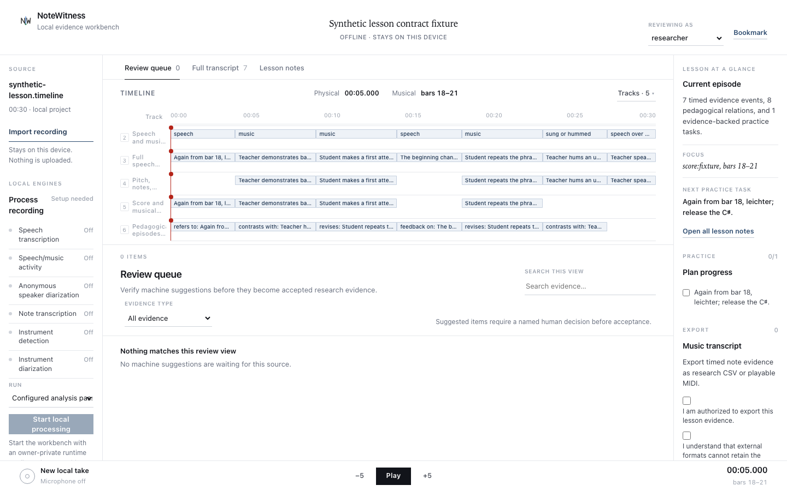
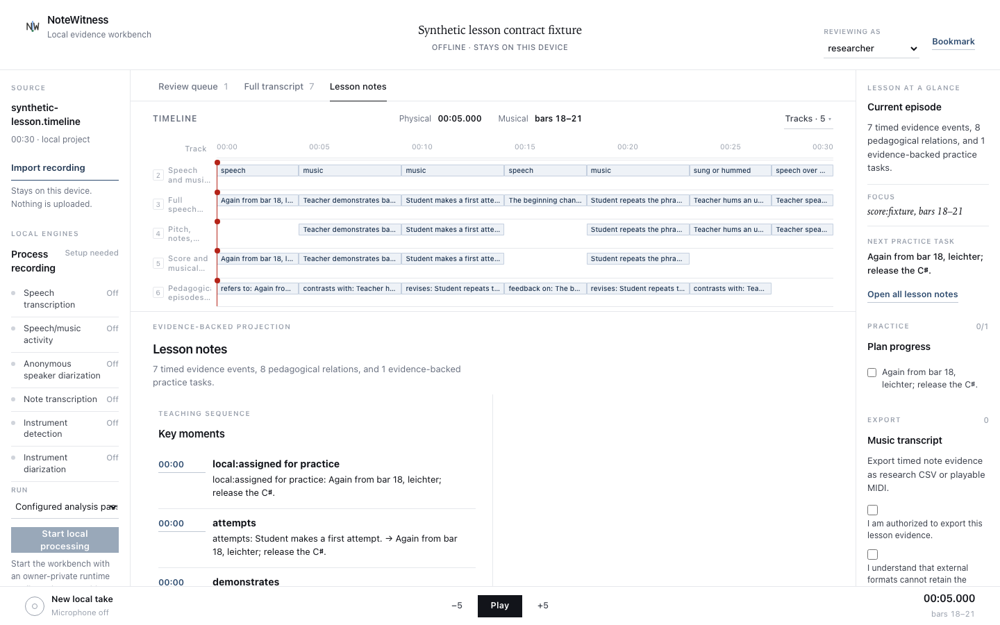
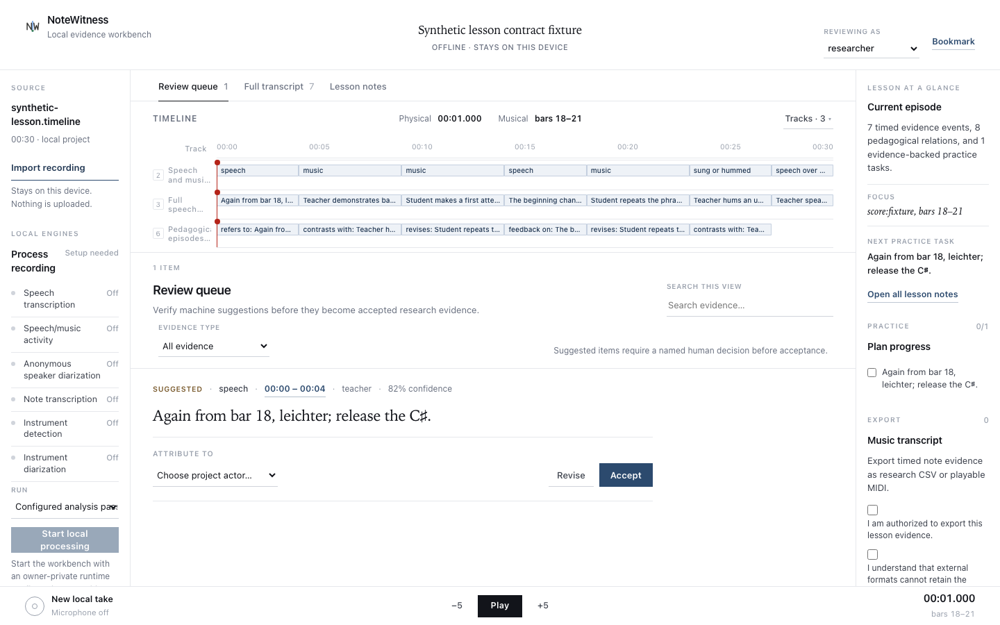

# NoteWitness

NoteWitness is a local-first research workbench for recorded music teaching and
artistic research. It stores source evidence, processing runs, model
hypotheses, human review decisions, and exports as separate records so that
later conclusions remain traceable to their source.

The repository is an alpha implementation. Its file formats, command-line
interface, and workbench routes may change before a stable release.

## Purpose and scope

NoteWitness supports evidence review around lesson recordings, score excerpts,
annotations, and derived music-analysis data. It is designed for a single
researcher working with local project directories.

The core runtime is dependency-free and offline by default. External speech
recognition, music-analysis, media-inspection, and remote text services are
optional integrations. NoteWitness records their provenance but does not bundle
their executables, model weights, or licenses.

## Current capabilities

- Create private project directories and validate their evidence documents.
- Import local media with a checksum and an explicit rights record.
- Record actors, review decisions, source ranges, annotations, and provenance.
- Plan and run local transcription through an explicitly configured adapter.
- Run staged music analysis through the documented analysis-suite protocol.
- Queue, resume, cancel, recover, and integrate durable analysis jobs.
- Inspect the evidence graph and preview proposed relationships.
- Review lesson notes, bookmarks, hypotheses, and source ranges in a loopback
  browser workbench.
- Export reviewed music data as CSV or MIDI.
- Use a tuner and metronome in the local workbench.
- Request remote text-only relationship suggestions when project policy,
  evidence rights, and per-call confirmation through `--allow-remote` all
  permit it.

The screenshots below show the repository's 1440 by 900 workbench fixtures. The
capture path uses the application UI with synthetic project state. They are
design references, not evidence of a packaged release.

[Open the static interface demo](https://sebastianspicker.github.io/notewitness/).
It is generated from the same workbench renderer and synthetic fixture used by
the screenshot path. Navigation runs in the browser; every command-capable
control is marked as simulated and cannot access media, run tools, upload,
persist, or export data.







See [docs/screenshots/README.md](docs/screenshots/README.md) for the capture and
review procedure.

## Current limitations

- No speech-recognition, music-analysis, or language model is bundled.
- Local external-tool execution requires macOS because the current runner uses
  `sandbox-exec` to deny network access.
- The external-tool sandbox does not provide filesystem confinement. Configured
  tools retain the filesystem permissions of the current user.
- The workbench is a loopback, single-user process. It is not a hosted service
  and has no multi-user authentication or authorization model.
- The browser tuner depends on microphone permission and browser audio support.
- Model quality, transcription accuracy, and research validity are not
  established by the repository test suite.
- Accessibility tests cover selected interaction contracts. They do not
  constitute a WCAG conformance audit.
- Project schemas, provider protocols, and command-line options are still
  alpha interfaces.

The detailed implementation matrix is in
[docs/capabilities.md](docs/capabilities.md).

## Requirements and prerequisites

- Python 3.11 or newer.
- A current browser for the workbench.
- Node.js for JavaScript syntax checks in the development verification script.
- macOS for CLI media ingest and commands that execute configured
  transcription or analysis tools.
- `ffprobe` for CLI media ingest and local transcription.
- Operator-supplied tools, model files, license metadata, and provider
  configuration for optional processing stages.

The package has no core runtime dependencies. It uses Hatchling as its build
backend.

## Installation

Run directly from the repository root:

```sh
PYTHONPATH=src python3 -m notewitness --help
```

For an isolated editable installation:

```sh
python3 -m venv .venv
. .venv/bin/activate
python3 -m pip install -e .
notewitness --help
```

The editable installation requires the Hatchling build backend declared in
`pyproject.toml`. If that backend is unavailable, use the checkout execution
path. Package verification status is recorded in
[RELEASE_STATUS.md](RELEASE_STATUS.md).

The installation exposes these commands:

- `notewitness`
- `notewitness-provider-bridge`
- `notewitness-mt3-events-bridge`

The provider bridge requires the optional package for its selected stage. The
MT3 events bridge normalizes an operator-supplied decoded-events file and does
not execute MT3. Both commands fail with a diagnostic when their input contract
is not satisfied.

## Configuration

NoteWitness starts without a runtime configuration and remains offline.
Automatic transcription and analysis require a private JSON file that follows
[docs/workbench-runtime.example.json](docs/workbench-runtime.example.json).
Copy the template outside the repository and restrict its permissions:

```sh
cp docs/workbench-runtime.example.json /path/to/private/notewitness-runtime.json
chmod 600 /path/to/private/notewitness-runtime.json
```

The runtime file contains paths and license declarations for operator-supplied
tools and models. Do not commit it.

Remote OpenAI requests require all of the following:

- Project network policy `remote_explicit`.
- Remote permission on every selected event and each targeted source.
- Per-call confirmation through the `--allow-remote` command-line flag.
- `OPENAI_API_KEY` in the process environment.
- `NOTEWITNESS_OPENAI_MODEL` in the process environment.

The model variable selects the required text model or snapshot. The adapter
sends only the selected text with request-local aliases, sets `store` to
`false`, and does not upload media.

See [docs/openai-endpoint.md](docs/openai-endpoint.md) for the request contract
and [docs/provider-bridges.md](docs/provider-bridges.md) for local provider
configuration.

## Usage

Create and inspect a project:

```sh
PYTHONPATH=src python3 -m notewitness init /path/to/private/project \
  --name "Lesson study"
PYTHONPATH=src python3 -m notewitness validate \
  /path/to/private/project/project.json
PYTHONPATH=src python3 -m notewitness inspect \
  /path/to/private/project/project.json
```

`init` prints the created `project.json` path. Commands that validate or inspect
the evidence graph take that document path. Workbench and processing commands
take the containing project directory.

Import media by creating a restricted rights record:

```sh
PYTHONPATH=src python3 -m notewitness ingest-media \
  /path/to/private/project \
  /path/to/private/lesson.wav \
  --create-restricted-rights \
  --ffprobe-path /absolute/path/to/ffprobe
```

The command reports the source identifier used by later processing commands.
It runs `ffprobe` through the macOS network-deny runner. The workbench can
stream an import without media probing when no automatic runtime is configured.
Inspect the available processing options before supplying external tools:

```sh
PYTHONPATH=src python3 -m notewitness transcription-plan \
  --job-id job:example \
  --source-id source:example \
  --duration-us 1000000 \
  --model-profile profile:precise
PYTHONPATH=src python3 -m notewitness capabilities
PYTHONPATH=src python3 -m notewitness doctor
PYTHONPATH=src python3 -m notewitness runtime-doctor
```

`doctor` and `runtime-doctor` exit with status 6 when required local components
are unavailable or incompatible.

Start the workbench without automatic providers:

```sh
PYTHONPATH=src python3 -m notewitness workbench \
  /path/to/private/project
```

Start it with a private runtime configuration:

```sh
PYTHONPATH=src python3 -m notewitness workbench \
  /path/to/private/project \
  --runtime-config /path/to/private/notewitness-runtime.json
```

Use `--no-open-browser` when the process should print the launch URL without
opening it. The complete operator workflow, including transcription, staged
analysis, review, integration, and export commands, is documented in
[docs/operator-guide.md](docs/operator-guide.md).

A repository fixture is available for non-sensitive inspection:

```sh
PYTHONPATH=src python3 -m notewitness validate \
  fixtures/synthetic_lesson/project.json
PYTHONPATH=src python3 -m notewitness inspect \
  fixtures/synthetic_lesson/project.json
```

## Repository structure

```text
.
├── src/notewitness/          Python package
│   ├── adapters/             External-tool contracts
│   ├── application/          Use cases and orchestration
│   ├── bridges/              Optional provider bridge entry points
│   ├── domain/               Evidence and transcription domain types
│   ├── infrastructure/       Local persistence
│   ├── presentation/         Loopback server and browser assets
│   └── providers/            Optional remote provider adapters
├── tests/
│   ├── javascript/           Browser-module contract checks
│   ├── support/              Shared test doubles and helpers
│   └── test_*.py             Python unit, integration, and contract tests
├── scripts/                  Repository verification and capture tooling
├── docs/                     Operator, protocol, product, and release references
├── fixtures/                 Synthetic non-sensitive project fixtures
├── schemas/                  Evidence graph schema and JSON-LD context
├── .github/                  CI and contribution templates
├── pyproject.toml            Package metadata and entry points
├── SECURITY.md               Security model and vulnerability reporting
└── CONTRIBUTING.md           Contribution requirements
```

The architecture and storage boundaries are described in
[docs/architecture.md](docs/architecture.md). The original research landscape
and design rationale remain in [RESEARCH_REPORT.md](RESEARCH_REPORT.md); that
report is not the authority for current capabilities.

## Development workflow

1. Read the relevant protocol and architecture documentation before changing a
   public schema or provider boundary.
2. Keep project data, media, credentials, model caches, and private runtime
   configuration outside the checkout.
3. Add focused tests for behavior changes.
4. Run the narrowest relevant test during development.
5. Run the broad repository verification before submitting a change.
6. Update commands, paths, schemas, examples, and limitations in the same
   change as the implementation.

Do not add a core runtime dependency without an explicit project decision.
External model behavior belongs behind an adapter with separate provenance for
code, model weights, and licenses.

## Testing

Run the Python test suite:

```sh
PYTHONPATH=src python3 -m unittest discover -s tests -t . -v
```

Run the broad local verification:

```sh
bash scripts/verify.sh
```

The broad script runs the Python tests, public-file hygiene checks, JSON
validation, CLI smoke tests, JavaScript syntax checks, tuner checks, and
workbench UI contract tests. The CI configuration runs it on Ubuntu with Python
3.11 and 3.14. A separate macOS job builds and installs the package, checks the
installed entry points and package assets, and performs fixture smoke tests.

These checks do not verify external model quality, real lesson media, browser
compatibility across engines, microphone hardware, or research conclusions.
Current local verification evidence is recorded in
[RELEASE_STATUS.md](RELEASE_STATUS.md).

## Deployment and operation

NoteWitness has no server deployment configuration, container image, or
external database. Operate it as a local process:

```sh
PYTHONPATH=src python3 -m notewitness workbench \
  /path/to/private/project \
  --port 8765 \
  --no-open-browser
```

The server binds to `127.0.0.1`. It prints a single-use launch URL, exchanges the
launch token for an `HttpOnly` and `SameSite=Strict` cookie, and validates host,
origin, and CSRF data on subsequent requests. Do not expose the loopback port
through a proxy or tunnel.

Stop the process with `Ctrl-C`. Project records, imported media references, job
state, and exports remain in the selected project directory. Back up that
directory according to the sensitivity and retention rules of the source
material.

## Troubleshooting

### A command exits with status 6

Status 6 indicates missing or incompatible runtime prerequisites. Run:

```sh
PYTHONPATH=src python3 -m notewitness runtime-doctor
```

For a configured provider, pass the same tool, model, and license paths used by
the processing command. Resolve every reported incompatibility before running
the provider.

### The workbench starts without automatic processing

This is the default offline behavior. Supply `--runtime-config` with a valid
version 2 runtime file if transcription or analysis actions should be enabled.

### The workbench rejects a request

Open the exact launch URL printed by the process. Do not reuse a launch token
from an earlier process. If the server reports an origin, host, or CSRF error,
close the old tab and reopen the current launch URL.

### Editable installation cannot find the build backend

Install from an environment that can obtain the build requirement declared in
`pyproject.toml`, or run from the checkout with `PYTHONPATH=src`.

### A model or tool is rejected

Check its exact version, checksum, path, input contract, and license declaration
against [docs/provider-bridges.md](docs/provider-bridges.md) and
[docs/analysis-suite-protocol.md](docs/analysis-suite-protocol.md). NoteWitness
does not infer compatibility from a filename.

## Security considerations

Keep lesson media, participant identifiers, credentials, model caches,
restricted scores, project directories, and private runtime files outside the
repository. Use the default offline mode unless remote text processing is
explicitly authorized.

Configured external tools execute with the current user's filesystem
permissions. The network sandbox limits those child processes but does not
protect against a malicious process already running as the same user. Review
tool provenance and licenses before execution.

The full threat model, supported versions, and private reporting guidance are
in [SECURITY.md](SECURITY.md).

## Contribution guidance

Contributions must preserve the evidence layers, privacy boundary, human review
model, and offline default. Tests should verify public behavior and protocol
invariants rather than implementation details. Update documentation whenever a
public command, path, schema, security property, or operating assumption
changes.

See [CONTRIBUTING.md](CONTRIBUTING.md) for the review checklist and required
verification.

## License

NoteWitness is licensed under the GNU Affero General Public License, version 3
or later. See [LICENSE](LICENSE).
