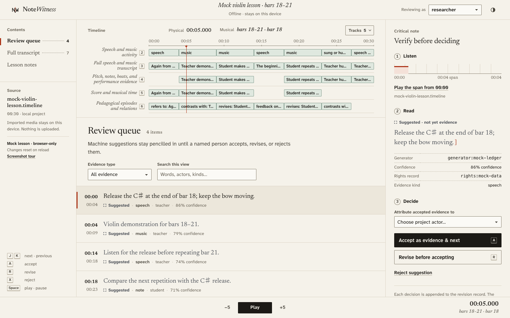
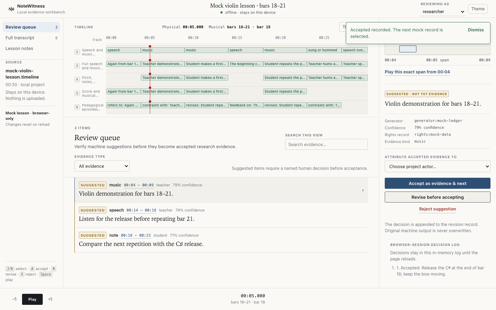
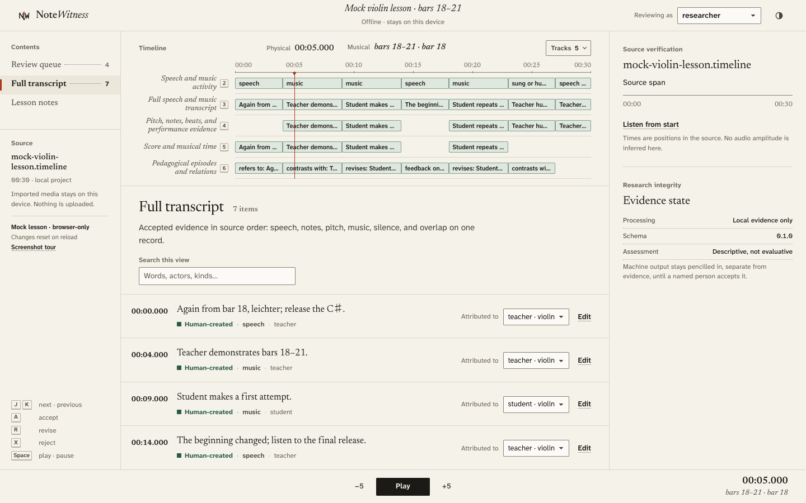
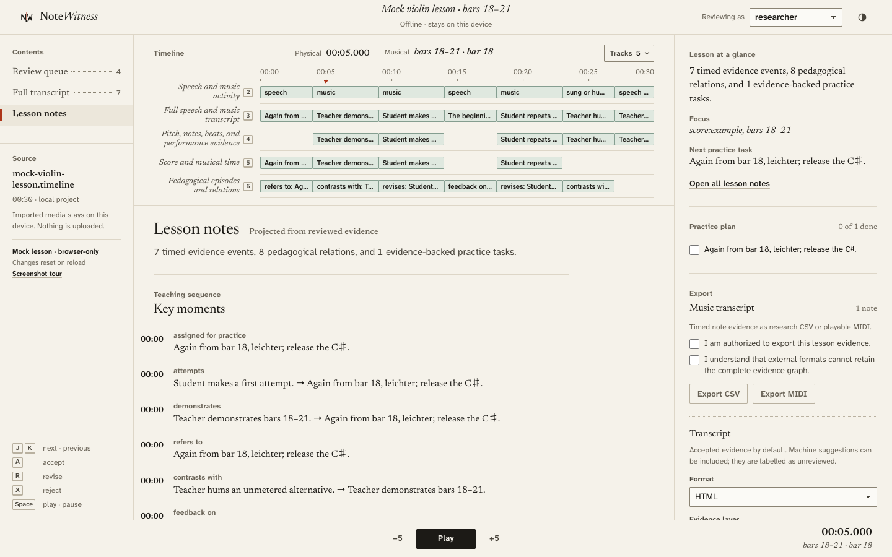
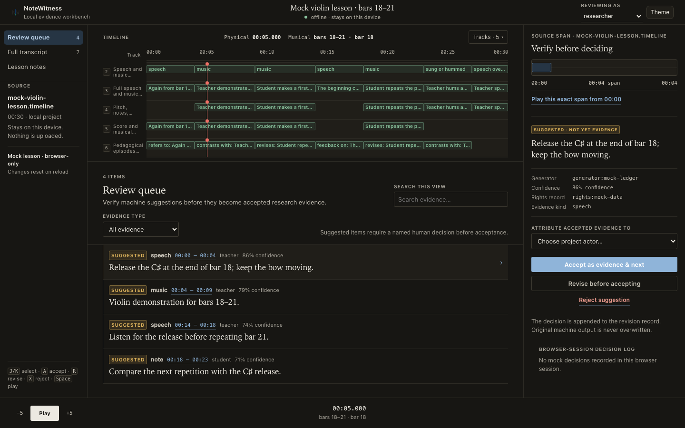
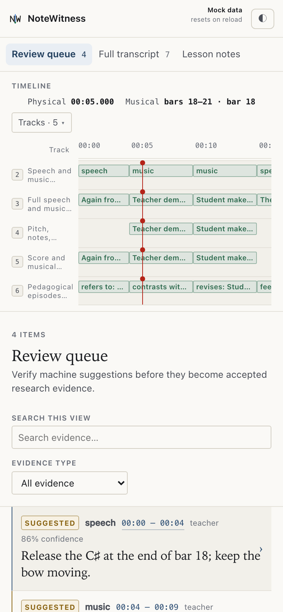

# NoteWitness

[](https://github.com/sebastianspicker/notewitness/actions/workflows/ci.yml)
[](https://github.com/sebastianspicker/notewitness/actions/workflows/pages.yml)
[](LICENSE)
[](pyproject.toml)

NoteWitness is a local-first evidence workbench for recorded music teaching and
artistic research. Recorded media, machine hypotheses, human review decisions,
and exports stay separate records, so every conclusion remains traceable to the
source span it came from.

> **Status: unreleased alpha.** File formats, the command-line interface, and
> workbench routes can change before a stable release.

## Screenshot tour

These captures come from the [interactive mock-data demo](https://sebastianspicker.github.io/notewitness/),
which runs the production workbench interface over a deterministic
synthetic violin lesson. They show the review workflow only and contain no
private lesson data. The full gallery lives on the
[tour page](https://sebastianspicker.github.io/notewitness/tour.html).

| | |
|---|---|
| <br>**Review queue.** Suggestions wait until a named person accepts, revises, or rejects them, with the source span, generator, confidence, and rights record in view. | <br>**Decision feedback.** Accepting appends a decision, advances the queue, and logs the outcome. Original machine output is never overwritten. |
| <br>**Full transcript.** Speech, notes, pitch, music, and overlap stay on one chronological evidence record. | <br>**Lesson notes.** An evidence-backed projection of the teaching sequence, practice tasks, and rights-gated exports. |
| <br>**Dark theme.** The same source-first layout in a low-light palette. | <br>**Narrow layout.** The review flow stays usable on a phone-sized viewport. |

## What it does

- Creates owner-private project directories and validates evidence documents.
- Imports local media with checksums and explicit rights records.
- Runs operator-supplied transcription and music-analysis tools through
  bounded, provenance-recording adapters.
- Queues, resumes, cancels, recovers, and integrates durable analysis jobs.
- Keeps machine suggestions separate from append-only human acceptance and
  revision records.
- Provides a session-authenticated loopback workbench for playback, review,
  bookmarks, lesson projections, capture, tuner, and metronome controls.
- Exports reviewed transcript and music evidence with explicit rights and
  projection-loss checks.
- Supports an optional, separately authorized OpenAI text-only suggestion
  path. It never uploads media automatically.

## Interactive mock-data demo

[Open the demo](https://sebastianspicker.github.io/notewitness/) and drive the
workbench in your browser. Review decisions, filters, navigation, source-span
selection, and transport controls update real in-browser mock state; reloading
restores the original lesson. The page makes no server requests and cannot
access devices, run local tools, upload media, persist project changes, or
create exports.

Build the same artifact locally:

```sh
demo_root="$(mktemp -d)"
bash scripts/build_pages_demo.sh "$demo_root/site"
python3 -m http.server 8000 --bind 127.0.0.1 --directory "$demo_root/site"
```

Then open `http://127.0.0.1:8000/`. This demo illustrates the interface and
review workflow only.

## Requirements

- Python 3.11 or newer.
- A current browser for the workbench.
- Node.js for the repository verification script and mock-data demo build.
- macOS for commands that run external tools through the current
  network-denying sandbox.
- Operator-supplied tools, models, and license metadata for optional processing.

The installed package has no runtime dependencies. Hatchling is used only to
build the package.

## Installation

Run directly from a checkout:

```sh
PYTHONPATH=src python3 -m notewitness --help
```

Or install into a virtual environment:

```sh
python3 -m venv .venv
. .venv/bin/activate
python3 -m pip install .
notewitness --help
```

The package installs three commands: `notewitness`,
`notewitness-provider-bridge`, and `notewitness-mt3-events-bridge`. Provider
runtimes and model packages remain operator managed.

## Quick start

Create and inspect a private project:

```sh
PYTHONPATH=src python3 -m notewitness init /path/to/private/project \
  --name "Lesson study"
PYTHONPATH=src python3 -m notewitness validate \
  /path/to/private/project/project.json
PYTHONPATH=src python3 -m notewitness inspect \
  /path/to/private/project/project.json
```

Start the local workbench:

```sh
PYTHONPATH=src python3 -m notewitness workbench \
  /path/to/private/project
```

The server binds to `127.0.0.1` and opens a single-use launch URL. Use
`--no-open-browser` to print that URL instead. Do not expose the port through a
proxy or tunnel.

Try the commands against the synthetic example:

```sh
PYTHONPATH=src python3 -m notewitness validate \
  examples/synthetic-lesson/project.json
PYTHONPATH=src python3 -m notewitness inspect \
  examples/synthetic-lesson/project.json
```

## Local processing

Automatic transcription and analysis require explicit executable, model,
version, and license configuration. Start from the runtime example, copy it
outside the checkout, and restrict its permissions:

```sh
cp docs/workbench-runtime.example.json /path/to/private/runtime.json
chmod 600 /path/to/private/runtime.json
PYTHONPATH=src python3 -m notewitness workbench /path/to/private/project \
  --runtime-config /path/to/private/runtime.json
```

Run `PYTHONPATH=src python3 -m notewitness runtime-doctor --help` to probe the
same local tools and models without starting a job.

The current macOS runner denies network access and bounds process execution,
but it does not confine filesystem access. Approved tools keep the invoking
user's filesystem authority and must therefore be trusted.

Use these references for the complete contracts:

- [Documentation index](docs/README.md)
- [Operator guide](docs/operator-guide.md)
- [Analysis-suite protocol](docs/analysis-suite-protocol.md)
- [Local provider bridges](docs/provider-bridges.md)
- [Optional OpenAI endpoint](docs/openai-endpoint.md)

## Repository structure

```text
src/notewitness/
  core/          Pure value types and domain rules
  projects/      Project storage, artifacts, and media
  analysis/      Local execution, transcription and analysis-suite pipelines, runs
  lessons/       Human review, projections, and exports
  workbench/     Loopback server and browser interface
  interfaces/    CLI and provider bridge entry points
tests/
  unit/          Focused value-rule and filesystem, process, and network boundary tests
  integration/   Project, analysis, lesson, and workbench integration tests
  contract/      CLI, capability, runtime, and architecture contracts
docs/            Architecture, protocols, operator guidance, and release process
examples/        Synthetic, non-sensitive project example
schemas/         Evidence graph schema and JSON-LD context
scripts/         Verification and mock-data demo tooling
```

The package is a feature-modular monolith. Dependencies flow from `interfaces`
through `workbench`, `lessons`, `analysis`, and `projects` toward the pure
`core` package. See [architecture.md](docs/architecture.md) and the recorded
architectural decisions
([0001](docs/decisions/0001-feature-modular-monolith.md),
[0002](docs/decisions/0002-authority-layers-and-feature-subpackages.md)). The
dated [research landscape](RESEARCH_REPORT.md) records prior art and product
rationale; it is not an implementation or release contract.

## Development and verification

Keep media, participant data, credentials, model artifacts, private runtime
configuration, and project directories outside the checkout. Add focused tests
for changed behavior and update public contracts in the same change.

Run the Python suite while editing:

```sh
PYTHONPATH=src python3 -m unittest discover -s tests -t . -v
```

Run the complete local gate before submitting a change:

```sh
bash scripts/verify.sh
```

The gate checks public-file hygiene, JSON, Python tests, CLI behavior,
JavaScript syntax, and the mock-data demo build. CI runs it on Python 3.11 and
3.14, then installs the package on macOS and checks all three entry points.

## Security and privacy

NoteWitness is offline by default. Remote text suggestions require project
policy `remote_explicit`, rights for every selected source and event, explicit
per-call confirmation, and the required environment configuration.

The loopback session, Host, Origin, and CSRF controls limit unintended browser
access. They do not defend against a malicious process running with the same
user and filesystem authority. Read [SECURITY.md](SECURITY.md) before handling
sensitive projects and [openai-endpoint.md](docs/openai-endpoint.md) before
enabling remote processing.

## Scope and limitations

No model, model weight, Whisper installation, FFmpeg/ffprobe executable,
analysis engine, browser, or media device is bundled. Implemented adapters do
not establish model accuracy, fairness, corpus suitability, or pedagogical
validity. The [capability matrix](docs/capabilities.md) records the exact
implemented and excluded scope, and the repository checks validate software
behavior rather than real media, model quality, browser or device support, or
research conclusions.

## Contributing and releases

See [CONTRIBUTING.md](CONTRIBUTING.md) for contribution requirements and
[docs/RELEASING.md](docs/RELEASING.md) for the release procedure. Report
security issues through a private channel as described in
[SECURITY.md](SECURITY.md).

## License

NoteWitness is licensed under the GNU Affero General Public License v3.0 or
later. See [LICENSE](LICENSE).
