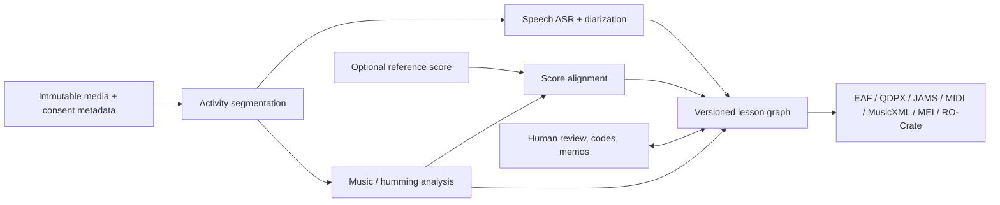

# NoteWitness: research landscape and project proposal

> Research snapshot: 18 July 2026
>
> Project name: NoteWitness
>
> Scope: recorded interviews, one-to-one lessons, masterclasses, and teaching-research material
>
> This is a research snapshot and proposed maturity roadmap, not current product truth. Implemented
> behavior is documented in [README.md](README.md),
> [docs/capabilities.md](docs/capabilities.md), and the machine-readable
> `notewitness capabilities` output. Roadmap phase labels below are research-planning labels, not
> package-version promises.

## Executive summary

The project's differentiation cannot simply be “noScribe with automatic note detection.” That combination would be useful engineering, yet both halves already exist: [noScribe](https://noscribe.de/en/) and [aTrain](https://github.com/aTrainTranscription/aTrain) provide established local interview transcription, while projects such as [Basic Pitch](https://github.com/spotify/basic-pitch), [MuScriptor](https://github.com/muscriptor/muscriptor), [YourMT3](https://github.com/mimbres/YourMT3), and [Omnizart](https://github.com/Music-and-Culture-Technology-Lab/omnizart) produce musical events. In 2026, commercial products have also moved directly into lesson capture: [Tonic Notes](https://www.tonicnotes.com/) distinguishes music from speech and creates lesson summaries, [Arco](https://arco.app/) builds searchable longitudinal lesson memory, and [ForteAI](https://forteai.org/) claims transcription plus performance feedback.

The proposal is a local-first, human-correctable, uncertainty-preserving research workbench that aligns language, performed sound, reference scores, embodied action, and qualitative interpretation on one timeline. Its proposed unit of analysis is not a transcript or a MIDI file, but a pedagogical episode such as:

> verbal cue → teacher demonstration → learner attempt → correction → revised attempt

Every node should remain linked to the original media, words, note or pitch hypotheses, score location, participant role, model version, confidence, and human edits. This would let a researcher ask not merely “what was said?” or “which notes were played?”, but “what changed in the student’s next attempt after this spoken and demonstrated correction?”

Five elements define the proposal's differentiation hypothesis:

1. A joint speech–music scene model. Preserve speech, playing, singing/humming, overlap, silence, and noise instead of forcing the recording through a speech-only or music-only pipeline.
2. A dual-time evidence graph. Align physical time in the recording with musical time, including beat, bar, score position, phrase, or an explicitly unmetered state.
3. Pedagogical episode relations. Represent demonstrations, attempts, feedback, references, repetitions, revisions, and non-corrective exploration as reviewable relations rather than flattening them into a summary.
4. Explicit uncertainty and provenance. Never hide model disagreement or overwrite a researcher’s interpretation; retain competing hypotheses and a complete edit history.
5. Open, local, interoperable research outputs. Export to speech, music, qualitative-analysis, and preservation formats instead of trapping work in a cloud product.

The recommended starting point is therefore not a new foundation model. It is a versioned lesson-graph schema, a consent-cleared pilot corpus, a synchronized correction interface, and adapters to existing ASR and music-transcription engines. The research MVP should target recorded one-to-one lessons and interviews with musical examples; masterclasses can follow only after multi-participant consent and attribution are designed. Universal ensemble transcription, live classroom surveillance, automated grading, emotion recognition, and claims about “teaching quality” should be explicit non-goals.

## 1. Purpose, audience, and research method

### Intended audience and decision

This report assumes the primary readers are a potential maintainer, music-education or artistic-research collaborators, and possible academic or public-interest funders. It answers three questions:

1. What can current open-source, research, and commercial systems already do?
2. Which unmet need is technically plausible and genuinely differentiated?
3. What should a new repository build first, and how should success be measured?

The proposed product is a research instrument first and a lesson-recall assistant second. That ordering matters. Consumer products already provide summaries and homework lists; a new open project should concentrate on inspectable evidence, correction, comparison, query, and reuse.

### Method

The landscape was checked on 18 July 2026. The review prioritizes official project sites, repositories, specifications, and research papers. Unless a more precise release date is shown, linked evidence was last accessed on that date. Release dates and licenses are reported only where an official source made them verifiable. Vendor feature descriptions are treated as vendor claims, not independent accuracy results. Paper metrics are treated as results on the authors’ datasets, not as expected performance in a reverberant teaching room.

“Closest” is not a claim of shared architecture or equivalent research quality. It means the strongest match found on at least one of four selection criteria: the teaching setting, joint handling of speech and music, qualitative/artistic-research workflow, or open/local inspectability. A maintained prior-art register should preserve the claim, source URL, access date, archived or versioned evidence where available, and the project decision it affected.

This is a representative landscape review, not an exhaustive systematic review, patent search, freedom-to-operate opinion, security audit, or hands-on benchmark of every product. Statements such as “no corpus was found” mean “none was found in this review,” not proof that none exists. The novelty claim must be rechecked before a grant, publication, or commercial launch because the field is changing quickly: MuScriptor was released on 10 July 2026, and the [Tonic Notes Android app](https://play.google.com/store/apps/details?id=com.pocketconservatory.mouni&hl=en) was updated on 15 July 2026.

### Terminology

- Speech transcription / ASR converts spoken audio into words.
- Speaker diarization answers “who spoke when” using anonymous speaker clusters; it is not necessarily identity recognition.
- Automatic music transcription / AMT estimates musical events such as pitches, onsets, offsets, instruments, beats, or chords from audio.
- Score following or alignment maps a performance onto an existing symbolic score.
- Notation is an interpreted, often quantized representation. It is not identical to the performed signal.
- Annotation means a human- or machine-created claim linked to a time span, score span, media region, or another claim.

## 2. What a music-teaching recording actually contains

A music lesson is not an interview with occasional noise, nor a performance with occasional talking. It is a coupled activity in which speech, sound, gesture, notation, and interpretation continually refer to one another.

| Layer | Examples | Why a single-purpose tool loses meaning |
|---|---|---|
| Language | explanation, metaphor, solfège, counting, note names, bar numbers, assignment | General ASR struggles with specialist names, code-switching, singing, and speech over playing. |
| Musical action | teacher demonstration, learner attempt, accompaniment, co-playing, humming, isolated note | A note detector does not know who played, whether it was intended, or whether it was an example, mistake, or correction. |
| Embodied action | fingering, bow path, breathing, conducting, posture, pointing at a score | Audio-only outputs cannot represent deictic references such as “here,” “this finger,” or “that release.” |
| Pedagogical relation | instruction, imitation, diagnosis, correction, repetition, reflection | A summary may mention these events but usually removes their evidence and exact sequence. |
| Research interpretation | code, memo, alternative reading, case comparison, analytic claim | Automatic outputs are not neutral ground truth; artistic research often needs ambiguity and multiple readings preserved. |

The first technical problem is therefore mode segmentation: classify and preserve `speech`, `music`, `speech_over_music`, `sung_or_hummed`, `silence`, and `other_sound`. A boundary error contaminates both downstream branches. Source separation may help, but it can also damage note attacks, pitch contours, or the very overlap a researcher wants to study. The original media must remain primary and every derived stem must remain optional and reversible.

The second problem is that the recording has two clocks:

- physical time: 00:12:08.740 in an audio or video stream;
- musical time: beat 2.4, bars 18–21, a phrase label, or “unmetered / no reliable alignment.”

Forcing every performance into clean notation would erase expressive timing, false starts, fragments, improvisation, microtonality, and extended technique. NoteWitness should keep continuous-time note or pitch evidence separate from quantized notation, and it must support material for which staff notation is inappropriate.

An illustrative episode might look like this:

| Recording time | Evidence | Research relation |
|---|---|---|
| 12:04.2 | Teacher: “Again from bar 18, but release the last note.” | instruction event; `refers_to` bars 18–21 |
| 12:08.7 | Teacher plays a four-bar violin phrase. | `demonstrates` the instruction |
| 12:14.1 | Student plays the same span with a late release. | `attempts` bars 18–21 |
| 12:23.0 | Teacher: “Yes, the beginning is lighter; listen to the end.” | `feedback_on` the attempt |
| 12:27.6 | Student repeats the phrase. | `revises` the earlier attempt |

The proposed unit of analysis is the linked episode and its evidence, not any one row.

## 3. Current landscape

### 3.1 Speech transcription and qualitative-research tools

The open speech-transcription field is mature enough that rebuilding a generic Whisper desktop app would add little value.

| Project | Current, source-backed strengths | License / deployment | Missing for music teaching |
|---|---|---|---|
| [noScribe](https://noscribe.de/en/) | Local Whisper/faster-whisper transcription, pyannote speaker handling, about 60 languages, pauses/overlap options, correction editor, HTML/TXT/WebVTT export. | GPL-3.0; Windows, macOS, Linux; [v0.7.2, 2 June 2026](https://github.com/kaixxx/noScribe/releases/tag/v0.7.2). | Instrumental and sung events have no first-class musical representation; no score or pedagogical relations. |
| [aTrain](https://github.com/aTrainTranscription/aTrain) | Offline faster-whisper plus diarization, GUI/CLI, timestamped output designed for MAXQDA, ATLAS.ti, and NVivo. | AGPL-3.0; [v1.4.1, 28 January 2026](https://github.com/aTrainTranscription/aTrain/releases/tag/v1.4.1). | Strong interview workflow, but the result remains speaker-attributed speech segments. |
| [Buzz](https://github.com/chidiwilliams/buzz) | Local file/live transcription, multiple Whisper backends, search and playback, watch folders, TXT/SRT/VTT. | MIT; Windows, macOS, Linux; [v1.4.4, 14 March 2026](https://github.com/chidiwilliams/buzz/releases/tag/v1.4.4). | General utility rather than a qualitative or music-research data model. |
| [WhisperX](https://github.com/m-bain/whisperX) | Engine-level batched ASR, word alignment, voice-activity detection, and pyannote diarization. | BSD-2-Clause code; local library/CLI, with external model downloads and model-specific access terms. | Phoneme/word alignment is not beat, bar, or score alignment; no end-user research workflow. |
| [Audacity transcription](https://www.audacityteam.org/features/transcription/) | Offline Whisper transcription into editable label tracks, including SRT/VTT/text export. | Audacity is open source and local. | Useful audio-editor baseline, not a participant/codebook/score/episode system. |
| [Transana](https://www.transana.com/) | Integrated coding of synchronized audio/video/text/PDF, clips, memos, reports, and automatic transcription; local Faster Whisper is available. | Proprietary perpetual-license desktop; [5.51, 14 April 2026](https://www.transana.com/products/download/). | The closest general research workflow, but it has no native note, beat, or score semantics. |

The lesson for this project is to reuse a proven local ASR stack and invest in music-aware segmentation, terminology correction, evidence links, and research interaction.

### 3.2 Annotation, analysis, and artistic-research platforms

| Project | What it contributes | Gap a new project should fill |
|---|---|---|
| [ELAN](https://archive.mpi.nl/tla/elan) | Unlimited hierarchical time-aligned tiers over audio/video, controlled vocabularies, EAF/XML, and, in [7.1](https://archive.mpi.nl/tla/elan/release-notes), REFI-QDA export and temporal co-occurrence output. GPL-3.0, local desktop. | It can represent lessons manually, but creating and linking speech, musical, gestural, and pedagogical tiers remains labor-intensive. |
| [EXMARaLDA](https://exmaralda.org/en/about-exmaralda/) | Time-aligned oral-corpus transcription, arbitrary categories, metadata, corpus search, and XML interchange with ELAN/Praat. | No first-class musical objects or automatic lesson episode graph; current redistribution terms should be confirmed before reuse. |
| [QualCoder](https://qualcoder.org/) | Open local CAQDAS for text/image/audio/video, hierarchical coding, cases, memos, reports, and optional local or remote AI. LGPL-3.0; [3.8.2, 26 February 2026](https://github.com/ccbogel/QualCoder/releases/tag/3.8.2). | Codes imported transcripts and media but does not jointly generate or align musical evidence. |
| [Sonic Visualiser](https://www.sonicvisualiser.org/) and [Vamp](https://www.vamp-plugins.org/) | Mature waveform/spectrogram/pitch views, editable annotation layers, plugin-based feature extraction, and MIDI/CSV/RDF export. | A reference for music inspection, but unaware of participants, speech, pedagogical roles, cases, and memos. |
| [RESEARCH VIDEO](https://researchvideo.zhdk.ch/) | Tracks, tags, transcription, annotation, and publication-oriented video designed for artistic and performative research; [source](https://github.com/StudioProcess/rvp) is GPL-3.0. | Strong artistic-research framing, but mostly manual and text-led, without automatic score/music evidence. |
| [Research Catalogue](https://www.researchcatalogue.net/portal/about) | A non-commercial, open-access rich-media platform where sound, image, video, and text can be equal parts of an artistic-research exposition. | It is a publication/collaboration destination, not an automatic analysis and correction workbench. |

These systems show that a new tool must not replace established research practice with a chat interface. It should provide tiers, codebooks, memos, cases, controlled vocabularies, alternative annotations, and durable exports, while reducing mechanical alignment work.

### 3.3 Automatic music transcription and audio-analysis projects

#### Open-source and open-weight building blocks

| Project | Directly supported capability | License / maturity signal | Appropriate role |
|---|---|---|---|
| [Basic Pitch](https://github.com/spotify/basic-pitch) | Polyphonic, instrument-agnostic audio-to-MIDI/CSV with pitch bends; its documentation says it works best on one instrument at a time. | Apache-2.0; v0.4.0 from August 2024; TensorFlow/CoreML/TFLite/ONNX runtimes. | Permissive default baseline for isolated demonstrations and attempts. |
| [MuScriptor](https://github.com/muscriptor/muscriptor) | July 2026 multi-instrument note and instrument events, optional instrument conditioning, MIDI/JSONL, and local UI/CLI. | MIT code, but CC BY-NC 4.0 gated weights; [v0.2.1, 10 July 2026](https://github.com/muscriptor/muscriptor/releases/tag/v0.2.1). No velocity; very new. | A current research comparator, not a default commercially reusable backend. |
| [MT3](https://github.com/magenta/mt3) | Multi-instrument sequence-to-sequence transcription with published checkpoints. | Apache-2.0; no formal release; repository says training is not easily supported. | Research baseline, brittle production dependency. |
| [YourMT3 / YourMT3+](https://github.com/mimbres/YourMT3) | Reproducible successor with multi-task/multi-track models and cross-dataset augmentation. | GPL-3.0; marked pre-release, no GitHub releases; checkpoint terms need separate audit. | Experimental adapter and fine-tuning route. |
| [Omnizart](https://github.com/Music-and-Culture-Technology-Lab/omnizart) | Pitched notes, vocal melody/contour, chords, drums, and beats in one toolkit. | MIT; latest formal release 0.5.0 in December 2021; documents ARM macOS and drum-training issues. | Benchmark inventory, not the foundation of a new maintained app. |
| [CREPE](https://github.com/marl/crepe) and [librosa pYIN](https://librosa.org/doc/latest/generated/librosa.pyin.html) | Monophonic fundamental-frequency contours with confidence/voicing information. | MIT and ISC respectively. | Transparent baselines for humming, singing, or an isolated sustained instrument; not polyphonic transcription. |
| [Demucs](https://github.com/facebookresearch/demucs) | Optional source separation for vocals, drums, bass, other, with an experimental six-source model. | MIT; official repository says it is no longer actively maintained. | Optional experiment only; separation artifacts can reduce downstream note accuracy. |
| [partitura](https://github.com/CPJKU/partitura), [Sync Toolbox](https://github.com/groupmm/synctoolbox), and [Match](https://cpjku.github.io/docs/match/specification/) | Symbolic score/performance handling, synchronization, and note/beat mappings with insertions/deletions. | Apache-2.0 / MIT / open documented format; partitura 1.9.0 and Sync Toolbox 1.4.2 were current in May 2026. | Score-aware layer when a reliable reference exists; never assume every fragment is alignable. |

Reported AMT scores must not be generalized to lessons. MuScriptor’s authors report large gains over YourMT3+ on their held-out music set, while the July 2026 [MulTTiPop](https://gclef-cmu.org/multtipop) work reports a best onset F1 of only 38% on real popular-music excerpts. Neither setting contains teacher–student speech, false starts, sung cues, room reverberation, or correction sequences. In a lesson, AMT should therefore produce reviewable hypotheses, not authoritative notation.

#### Commercial audio-to-score products

| Product | Current capability claim | Boundary |
|---|---|---|
| [Klangio Transcription Studio](https://klang.io/transcription-studio/) | Multi-instrument transcription with notation/piano-roll editing and MIDI, MusicXML, PDF, and tablature-oriented exports. | Proprietary cloud/browser product focused on songs and scores, not lesson dialogue or qualitative research. |
| [AnthemScore](https://lunaverus.com/) | Local desktop and web audio-to-sheet-music workflow with MIDI/MusicXML/PDF; instrument and percussion detection. | Proprietary; its official FAQ says vocals and chords are not currently detected. |
| [Songscription](https://songscription.net/) | Browser audio/URL to editable notation, piano roll, MIDI/MusicXML/Guitar Pro. | Proprietary consumer workflow; notation quality remains repertoire-dependent. |
| [Soundslice](https://www.soundslice.com/features/) | Synchronized score, audio/video, looping, slowdown, multitrack practice, and automatic syncpoint assistance. | Primarily a score/practice platform; it does not provide an auditable speech–music lesson graph. |

These products confirm that “audio to notes” and “score synchronized with media” are no longer novel by themselves.

### 3.4 Music-learning and performance-feedback systems

This is the most important competitive lane because several products already target the exact setting.

| System | Observed or claimed capability | What remains open |
|---|---|---|
| [Tonic Notes](https://www.tonicnotes.com/) | Records in-person lessons, stores speech-vs-music timestamps, speaker-attributed transcripts, summaries, homework, and links back to audio. Its [terms](https://www.tonicnotes.com/terms) describe a 2026 beta with US cloud storage and optional use of de-identified material for improvement. | Proprietary consumer memory tool; no exposed note/score model, codebook, provenance graph, research query, or standards export. |
| [Arco](https://arco.app/) | Music-domain transcription, lesson notes, sharing, chat over longitudinal history, plans, reports, and PDF/Markdown exports; processing requires internet. | Longitudinal interpretation without an open, signal-level, reproducible research instrument. |
| [ForteAI](https://forteai.org/) | Vendor claims lesson recording/transcription and scoring of timing, intonation, dynamics, and phrasing for many instruments. Cloud is required for transcription/analysis. | The public site does not expose an auditable model, benchmark, correction provenance, interoperable event data, or qualitative-research workflow. |
| [PracticePlay](https://www.practiceplay.app/) | Fully local/on-device music activity detection and hands-free capture/playback of playing episodes; deliberately ignores conversation as a trigger. | Narrow interaction pattern that records performances rather than linking them to instructional dialogue. |
| [TELMI](https://telmi.upf.edu/) | The 2016–2019 EU project built multimodal music-learning prototypes using audio, video, motion, and sensors, plus performance exercises and a public database. | Closest research predecessor, but oriented to performance/technique feedback rather than an integrated speech transcript and qualitative lesson graph. |
| [Open Music Academy](https://openmusic.academy/?language=en) | Open educational music resources with interactive audio/video, multitrack playback, ear training, media analysis, and notation. | Teaching and OER platform, not automatic transcription of real lessons. |
| [Score-informed education prototype](https://ismir2025program.ismir.net/lbd_482.html) | 2025 work in progress combines guitar/piano/violin transcription, score alignment, and pitch/rhythm/tempo/structural/intonation error detection. | Performance assessment, not the speech–demonstration–attempt–feedback research sequence. |

The competitive conclusion is narrower than it first appeared: music-aware lesson notes and automated performance feedback already exist. A new project is justified only if it offers open inspection, local control, multimodal evidence, human correction, research methodology, and interoperable data that these products do not expose.

### 3.5 Datasets and interoperability standards

#### Relevant datasets

| Dataset | Contribution | Why it does not close the lesson gap |
|---|---|---|
| [TELMI Open Database](https://telmi.upf.edu/opendatabase/) | Multimodal violin-performance exercises associated with teachers, enriched features, and music-learning research context. | The public catalogue is exercise/performance-oriented; its terms prohibit redistribution and commercial use despite the project page’s general CC wording. It is not a freely redistributable conversational lesson corpus. |
| [Rach3](https://dataset.rach3project.com/) | Longitudinal piano rehearsal with synchronized video, audio, MIDI, logs, mood questionnaires, and MusicXML/MEI scores. | Practice/rehearsal rather than teacher–student lessons; access is being released in subsets and may require contacting the team. |
| [MAESTRO](https://magenta.tensorflow.org/datasets/) | Roughly 200 hours of closely aligned virtuosic piano audio and MIDI. | Clean complete performances, no speech, mistakes-as-pedagogy, or correction dialogue. |
| [Slakh2100](https://github.com/ethman/slakh-generation) | About 145 hours of synthesized multitrack mixtures with aligned MIDI. | Synthetic song rendering creates a major domain gap from real rooms and lesson interaction. |
| [MedleyDB](https://github.com/marl/medleydb) and [GuitarSet](https://zenodo.org/records/3371780) | Real multitrack music; detailed guitar notes, pitch contours, chords, beats, and playing style in JAMS. | Music performances rather than conversational teaching. |
| [MUSCAT](https://grfia.dlsi.ua.es/muscat/) and [MulTTiPop](https://gclef-cmu.org/multtipop) | Real audio-to-score and multi-instrument AMT material. | Music-only recordings; rights and durable redistribution need dataset-specific review. |

No public corpus found in this review jointly annotates all of the following: teacher/student roles; speech, music, humming/singing, and overlap; performed and intended notes; score references; demonstration/attempt/correction/retry relations; and human-revision provenance. Building a carefully governed Music Lesson Multimodal Corpus is therefore as important as building the application.

#### Standards to reuse

The internal model should be lossless and project-specific; established formats should be tested projections from it.

| Standard | Relevant role | Expected loss or limitation |
|---|---|---|
| [ELAN EAF](https://archive.mpi.nl/tla/elan) | Participant, speech, gesture, and qualitative time tiers. | No native symbolic music semantics. |
| [REFI-QDA / QDPX](https://www.qdasoftware.org/) | Exchange of qualitative projects, codebooks, coded sources, and cases. | QDA tools differ, so the standard itself warns that exchange can lose features. |
| [JAMS](https://jams.readthedocs.io/) | Multiple time-aligned MIR annotations such as pitch, onset, beat, chord, and segment, with curator/model metadata. | No native rich score or pedagogical relation model. |
| [Standard MIDI File](https://midi.org/standard-midi-files) | Broad note-event interchange and audition. | Weak notation, intent, uncertainty, provenance, and dialogue semantics. |
| [MusicXML 4.0](https://www.w3.org/2021/06/musicxml40/) | Editable common-Western notation interchange. | Not designed for competing uncertain hypotheses or pedagogical evidence graphs. |
| [MEI 5.1](https://music-encoding.org/guidelines/) | Scholarly notation, editorial states, analysis, facsimile/recording links. | More complex and less uniformly supported by notation editors. |
| [W3C Web Annotation](https://www.w3.org/TR/annotation-model/) | JSON-LD links between claims and precise media or data targets, with motivation and provenance. | Requires a domain vocabulary for musical pedagogy. |
| [RO-Crate](https://www.researchobject.org/ro-crate/specification/1.1/introduction.html) | Packaging media references, software, models, equipment, licenses, provenance, and research outputs. | A preservation/package layer, not the interactive annotation model itself. |

## 4. Gap analysis

Existing systems form capable but disconnected islands:

| System family | Speech / speakers | Music events / score | Qualitative coding | Lesson semantics | Local + open |
|---|---:|---:|---:|---:|---:|
| noScribe / aTrain | Strong | None | Handoff | None | Yes |
| ELAN / QualCoder | Manual/imported | Manual/generic tiers | Strong | Researcher-created | Yes |
| Sonic Visualiser | None | Strong inspection/features | Music annotations | None | Yes |
| Basic Pitch / MuScriptor | None | Strong hypotheses | None | None | Yes, with weight caveats |
| Tonic Notes / Arco | Strong, music-domain | Playback segments; no exposed event model | Notes/summaries | Product-specific summaries | No |
| ForteAI | Vendor-claimed | Vendor-claimed performance metrics | None exposed | Feedback/assignments | No |
| TELMI | Limited speech focus | Strong multimodal performance research | Study-specific | Technique/learning prototypes | Mixed; data terms restrictive |
| NoteWitness proposal | Strong and correctable | Hypotheses plus score alignment | Native | Reviewable episode graph | Yes |

The missing bridge is not merely temporal synchronization. ELAN, Sonic Visualiser, Soundslice, and TELMI already synchronize media and annotations. The missing bridge is a shared, queryable semantics with evidence:

- who or what produced an event;
- whether it was speech, demonstration, attempt, accompaniment, or correction;
- what score span or musical idea it referred to;
- which later event responded to or revised it;
- whether the relation was model-proposed, human-accepted, rejected, or disputed;
- which model, version, parameters, and source span produced every machine claim.

### Differentiation boundary

The following would not establish sufficient differentiation:

- a Whisper GUI with Basic Pitch added;
- an automatic lesson summary or homework checklist;
- a generic audio-to-MIDI or audio-to-score service;
- a proprietary cloud dashboard that assigns a single performance or teaching score;
- a new multimodal model demonstrated only on clean performance datasets.

The stronger claim is:

> NoteWitness is an open, local-first system for creating and studying uncertainty-preserving pedagogical evidence graphs that jointly link speech, performed music, reference scores, embodied annotations, and human interpretations. Its first test case is the demonstration–attempt–feedback–revision sequence.

That is a landscape-based differentiation hypothesis, not a claim of patent novelty. Its credibility ultimately depends on a systematic literature review, an ethically collected lesson corpus, benchmarked correction-time savings, and publication of the schema and evaluation protocol.

## 5. Proposed project: a music-lesson evidence workbench

### 5.1 Product thesis and differentiation hypothesis

Product thesis: researchers and teachers should be able to move from a raw lesson recording to an editable map of what was said, played, demonstrated, corrected, and changed without uploading sensitive media or losing the evidence behind a derived summary.

NoteWitness should be a cross-platform desktop workbench with an optional command-line/batch layer. It should run locally after an explicit model-install step, remain functional with outbound networking disabled, and treat automation as suggestions that accelerate human analysis.

Its central data structure is a Pedagogical Evidence Graph. A graph is necessary because one utterance may refer to several score spans, one demonstration may answer an earlier question, and a later comment may compare multiple attempts. A repair sequence, the cycle through which an idea or performance is demonstrated, attempted, diagnosed, altered, and tried again, is the first named graph profile to evaluate. It is not a claim that all teaching or artistic inquiry is corrective. Co-design must test the terminology and admit exploratory, collaborative, reflective, and interview episodes that contain no “repair.”

Core relation types should initially be few and observable:

- `demonstrates`: a played, sung, gestural, or spoken event exemplifies an instruction or idea;
- `attempts`: a learner event tries to realize a task, phrase, or score span;
- `feedback_on`: an utterance, gesture, or played example responds to an attempt;
- `refers_to`: an event points to a note, phrase, bar, recording span, gesture, or prior event;
- `repeats`: an event intentionally repeats another event or score span;
- `revises`: a later attempt is a revised realization of an earlier one;
- `contrasts_with`: two examples are presented or analyzed as a contrast.

Projects may add controlled local relations such as `explores`, `co_constructs`, or `reflects_on`, but these should not become universal defaults until their meanings and annotation reliability have been tested across teaching and musical traditions.

These relations must never be presented as objective pedagogical truth. The interface should distinguish `machine_suggested`, `human_accepted`, `human_created`, `rejected`, and `contested`, and allow parallel interpretations by different researchers.

The project’s contribution is consequently a combination of research infrastructure, interaction design, domain data, and evaluation, not ownership of the underlying ASR or AMT models.

### 5.2 Users and priority workflows

#### Primary users

1. Music-education researcher: studies how verbal, sonic, and embodied feedback changes subsequent performance.
2. Artistic researcher: combines media, annotations, reflection, and alternative interpretations for an exposition or publication.
3. Instrumental/vocal teacher: reviews a lesson, confirms assignments, and compares demonstrations with student attempts.
4. Student or participant: can revisit authorized evidence and exercise consent, access, correction, withdrawal, or deletion rights through a documented participant-request process; this does not assume every participant has an application account.
5. Research data steward: packages a reproducible, rights-aware research object without exposing restricted media.

#### Priority workflow A: score-based one-to-one lesson

1. Create a project, record consent and access conditions, and import audio/video plus optional MusicXML, MEI, or MIDI.
2. Run local activity segmentation, ASR/diarization, note/pitch analysis, and score alignment.
3. Review one synchronized timeline; correct speaker roles, mode boundaries, words, notes, and score positions.
4. Accept or create links between instruction, demonstration, attempt, feedback, and retry.
5. Apply a qualitative codebook and write memos without changing the underlying evidence.
6. Compare attempts, query episodes, and export an EAF/QDPX/JAMS/RO-Crate research package.

#### Priority workflow B: improvisation, extended technique, or no score

The system must remain useful without notation. It should expose waveform, spectrogram, continuous pitch, onset/segment suggestions, clips, participant roles, and free/controlled annotations. A researcher can label a gesture, timbral change, texture, metaphor, or interaction without inventing a bar number or pitch class.

#### Priority workflow C: interview with musical examples

The researcher imports an interview in which participants sing, hum, play excerpts, or discuss recordings. NoteWitness preserves these examples as musical events linked to the surrounding talk and exports a conventional transcript plus richer research annotations.

### 5.3 Core interaction design

The main view should be one zoomable, keyboard-accessible timeline with synchronized lanes:

1. source video and/or waveform;
2. spectrogram and playback controls;
3. speech/music/humming/overlap activity;
4. participant and word-aligned transcript;
5. performance evidence such as pitch contour, piano roll, beats, or score cursor;
6. pedagogical episodes and relations;
7. researcher codes, memos, and alternative annotations.

The interface should optimize for verification, not the spectacle of automation:

- clicking any word, note, code, or relation plays the exact source span;
- machine confidence is visible but not mistaken for calibrated certainty;
- low-confidence and cross-pipeline disagreement create a review queue;
- original and separated audio can be A/B auditioned;
- a score view shows both performed timing and any quantized interpretation;
- two attempts can be aligned and auditioned side by side;
- correcting a repertoire term can safely propagate through derived views while retaining the original output and audit trail;
- rerunning a model creates a new derived layer and never overwrites human work;
- every export previews which information will be lost.

Accessibility basics are part of the core: full keyboard operation, visible focus, scalable text, high-contrast alternatives to color-only confidence encoding, captions, screen-reader labels, and the ability to work from transcript or score without requiring precise pointer use.

### 5.4 Technical architecture and data model

#### Recommended shape

- Desktop shell and web-based UI: cross-platform local application; no account required for a single-user project.
- Analysis worker: isolated Python processes or services for ASR, MIR, and alignment adapters. Jobs are cancellable, bounded, resumable, and versioned.
- Project database: SQLite for metadata, graph relations, edits, and indexes; media and large derived arrays remain files addressed by content hash.
- Canonical schema: JSON Schema plus JSON-LD context for exchange and validation.
- Plugin contract: model adapters read normalized media spans and emit typed hypotheses; they cannot write directly to accepted human annotations.
- Identity and access: a single-user project relies on the operating-system account, encrypted storage, and local file permissions rather than requiring a service account. The research MVP adds explicit project roles such as owner, data steward, annotator, and viewer, plus participant requests. Each annotation package declares its source project, schema version, media checksums, project-scoped annotator ID, revision parents, and export time, with an optional signature. An owner must map that identity to an authorized local role before import; unknown packages open in a quarantined preview. Authorized packages merge by stable ID and revision parent, and divergent edits become visible branches rather than silent last-write-wins updates.
- `CLI`: reproducible batch processing, schema validation, export, and benchmark commands for research workflows.

No inference engine should perform blocking work on the UI or audio playback thread. Long files should be processed in bounded chunks with explicit continuity metadata. Queues must be bounded, cancellation must leave the project valid, and partial outputs must be labeled incomplete.

#### Non-negotiable data invariants

1. While retained, source media are immutable within a project and identified by a cryptographic checksum; an authorized erasure workflow deletes them rather than modifying them in place.
2. All events use a canonical monotonic media timeline; display timecodes are derived.
3. Stable event IDs survive model reruns and exports wherever the underlying human annotation is unchanged.
4. Raw model output, normalized hypothesis, accepted annotation, and presentation/summary are separate layers.
5. While retained, human edits are append-only revisions or explicit replacements, not silent mutations. Applicable withdrawal, erasure, or retention rules supersede analytic history.
6. “Unknown,” “not detected,” “not applicable,” and “not alignable” are distinct states.
7. Every automatic assertion is traceable to source span, adapter, model/weight hash, version, parameters, and creation time.
8. Derived files never acquire broader access or reuse rights than their restricted source by default.

#### Minimum canonical records

The schema must not hide relations inside a generic event value. At minimum it needs independently versioned records:

| Record | Required content | Purpose |
|---|---|---|
| `Event` | `id`, `type`, `actor_id`, `target_ids[]`, body/value, alternatives, generator, confidence kind, review status. | A word, note, contour, activity, code, memo, gesture, assignment, or other claim. |
| `Target` | `id`, source ID, canonical start/duration, optional stream and spatial selector, optional musical-time/score selector, alignment state. | Points an event or relation to audio, video region, score span, another annotation, or an external research object. |
| `Relation` | `id`, controlled type, ordered `arguments[]` with semantic roles and event/target IDs, generator, confidence, annotator, review status. | Represents `demonstrates`, `attempts`, `feedback_on`, `refers_to`, `repeats`, `revises`, `contrasts_with`, or a project vocabulary term. |
| `Revision` | `id`, record ID, parent revision(s), author/originator, timestamp, operation, reason, superseded state. | Preserves edit lineage, merge branches, rejection, and adjudication without overwriting another interpretation. |
| `Actor` | project-scoped pseudonymous ID, confirmed project role, optional instrument/ensemble role, visibility. | Separates analytic identity from real-world identity and permits unknown or disputed attribution. |
| `Rights` | asset/record ID, authority or consent basis, permitted purposes, access tier, retention/withdrawal state, export and training permissions. | Prevents code, project, or parent-media licenses from being incorrectly inherited by every derivative. |
| `Generator` | adapter/code version, model and weight hashes, parameters, environment manifest, job ID, creation time. | Makes every automatic assertion reproducible and traceable. |

Every evidence-bearing event has one or more `target_ids`; only project-level objects such as a codebook definition may use an empty target list, and then must declare `scope: project`. Targets are project-scoped address objects that may be reused by several events or relations; they do not own annotations. A relation can have multiple or ordered arguments. For example, one feedback event can address two earlier attempts and a score span. Video/gesture evidence needs a stream ID, temporal bounds, and an optional spatial selector rather than only audio time. Human-created and machine-suggested relations use the same structure but keep distinct generator and review states. Alternative or contested interpretations remain parallel records linked by revision or adjudication metadata. Orphan-target cleanup is explicit and rights-aware, never a side effect of editing one event.

The graph should use Web Annotation-style bodies and targets where practical, but keep a compact relational index for interactive performance. JSON-LD is an interchange representation, not a requirement to run a graph database.

### 5.5 Model strategy

#### 1. Segment before transcribing

Build or adapt a lightweight scene classifier for speech, music, singing/humming, overlap, and other sound. Optimize overlap recall, not just overall accuracy. Preserve manual boundary correction and permit both ASR and AMT to run on the same span when appropriate.

#### 2. Reuse a local speech stack

Start with a swappable faster-whisper/WhisperX-style adapter, anonymous diarization, word timing, and a project lexicon for performer names, repertoire, techniques, solfège, chord symbols, and multilingual terminology. Speaker identity and teacher/student roles should be confirmed manually; default behavior should not build persistent voiceprints.

#### 3. Route musical spans by evidence type

- Basic Pitch as the permissively licensed note-event baseline for isolated instruments;
- pYIN or CREPE for monophonic humming, singing, and sustained tones;
- beat/onset/chord adapters only where the research question requires them;
- MuScriptor and YourMT3 as optional research comparators with clearly separated license status;
- raw pitch/onset evidence when notation would be misleading;
- optional Demucs-like separation only as an alternate hypothesis, never a destructive preprocessing step.

#### 4. Align only when a reference is credible

Use symbolic score handling and synchronization adapters to map performance evidence to a known score. The algorithm must tolerate fragments, restarts, insertions, deletions, and skipped sections, and it must be able to conclude “not reliably alignable.” Improvisation and open-form work should not be penalized for lacking a score match.

#### 5. Infer pedagogy last and conservatively

Begin with transparent rules and researcher confirmation: proximity, participant role, repeated score span, discourse markers, and detected demonstration/attempt boundaries. Only train a relation model after a domain corpus and annotation manual produce acceptable inter-rater agreement. A language model may propose labels or retrieval queries, but it must not rewrite evidence or present artistic interpretation as fact.

#### 6. Maintain a machine-readable model ledger

For every adapter record code license, weight license, source URL, hash, supported hardware, network/download requirements, intended domain, known limitations, and whether commercial use or redistribution is permitted. Code and model weights are separate artifacts; “open code” does not make non-commercial weights open source.

### 5.6 Interoperability and research outputs

Each export should be a documented, tested projection:

- `WebVTT/SRT/TXT/HTML`: conventional transcript and caption workflows;
- `EAF`: participants, speech, gesture, activity, episode, and code tiers;
- `QDPX`: codebooks, cases, coded media/transcripts, and memos for CAQDAS handoff;
- `JAMS`: pitch, note, onset, beat, chord, segment, and custom lesson-event annotations;
- `MIDI`: continuous-time note hypotheses for audition/editing;
- `MusicXML`: editable common-notation interpretation when justified;
- `MEI`: scholarly music representation, editorial alternatives, and recording links;
- `Match`: score/performance mapping where a reference score exists;
- JSON-LD/Web Annotation: full relation graph and precise media targets;
- `RO-Crate`: reproducibility package with source references, rights, equipment, software, models, parameters, checksums, and derived outputs.

Round-trip tests must cover IDs, participant mapping, timestamps, Unicode, controlled vocabularies, overlapping intervals, null/unknown values, and rights metadata. A successful file write is not proof of semantic interoperability. Export documentation should name every dropped or transformed field.

For artistic research, a publication pack could generate stable media clips, captions, annotation extracts, alt text, and a manifest suitable for manual inclusion in a Research Catalogue or RESEARCH VIDEO exposition. Direct publishing should come later and require explicit user confirmation.

## 6. MVP, non-goals, and roadmap

### Release definitions

The phases below describe research maturity, not marketing labels. To keep “first release” and “MVP” unambiguous:

| Release | Included scope | Deliberately deferred |
|---|---|---|
| v0.1 vertical slice | A synthetic fixture plus one governed, consent-cleared, score-based one-to-one pilot; local ingest, activity segmentation, ASR, one music adapter, manual evidence links, and core exports. | General users, multi-annotator work, trained relation inference, broad instrument claims. |
| v0.2 music-aware alpha | Consent-cleared one-to-one pilots; note/pitch evidence, optional score alignment, no-score mode, attempt comparison, correction and provenance workflow. | Masterclasses, live capture, cloud collaboration, generalized accuracy claims. |
| v0.3 research MVP | Recorded one-to-one lessons and interviews with musical examples; codebooks/memos/cases, versioned annotation exchange, relation suggestions, benchmark protocol, and the tested export set below. | Multi-party classroom/masterclass release, consequential assessment, real-time intervention. |
| v1 research release | Stable schema/plugin contract, independently reproduced benchmark, documented migrations, governance and controlled-data process. | Anything that has not passed an explicit ethics, accuracy, usability, and sustainability gate. |

Masterclasses remain a later research target because multiple participants, instruments, cameras, institutions, and consent relationships make identity, attribution, access, and withdrawal materially harder. The term MVP below means v0.3, not the first executable prototype.

### Research MVP (v0.3): one-to-one lesson and musical-interview workbench

The v0.3 research MVP should support:

- one primary audio or video recording, with optional separately recorded tracks and optional MIDI/MusicXML/MEI reference;
- two or a small number of participants with anonymous diarization and manually confirmed roles;
- correctable speech/music/humming/overlap segmentation;
- local word-timed ASR with domain vocabulary and transcript editor;
- pitch/note hypotheses for isolated musical spans plus an explicitly “unsupported/uncertain” state;
- optional score alignment with visible insertions, deletions, fragments, and failure;
- synchronized transcript, waveform/spectrogram, piano-roll or pitch lane, and score view;
- manual creation and machine suggestion of the small relation vocabulary in section 5.1;
- qualitative codebooks, cases, memos, and multiple annotators’ interpretations;
- tested EAF, VTT, JAMS, MIDI, JSON-LD, and RO-Crate export;
- QDPX, MusicXML, and MEI as v0.3 release gates: each adapter must pass its predefined round-trip/loss tests, or the release scope/version must be revised rather than shipping it as an undocumented experimental export;
- a reproducibility manifest and a strict local/offline mode.

### Explicit non-goals through the research MVP

- live classroom surveillance or always-on recording;
- reliable attribution of every played note to a person or instrument from a single room microphone;
- universal polyphonic score engraving;
- real-time teaching intervention;
- automated grades, admissions decisions, “talent,” “engagement,” emotion, personality, or teaching-effectiveness scores;
- automatic posture or injury diagnosis;
- replacement of a teacher, researcher, or human transcription review;
- a general learning-management, billing, or scheduling platform;
- cloud collaboration before the local data and consent model is proven.

### Suggested 18-month research-and-build roadmap

| Phase | Months | Deliverable | Exit evidence |
|---|---:|---|---|
| 0. Co-design and governance | 0–2 | Research protocol, consent/access model, use-case interviews, annotation manual, initial schema, license ledger. | Ethics/data-governance review; researchers can annotate the same fixture with acceptable agreement. |
| 1. Evidence spine (v0.1) | 2–5 | Local ingest, immutable media, activity/ASR adapters, one baseline music adapter, synchronized editor, manual evidence links, EAF/VTT/JAMS/JSON-LD/RO-Crate. | Offline network-denial test; timestamp/export fixtures; end-to-end correction of the synthetic lesson and one consent-cleared lesson. |
| 2. Music-aware alpha (v0.2) | 5–9 | Additional pitch/note adapters, score import/alignment, A/B attempt comparison, richer evidence-graph review, MIDI. | Instrument-stratified AMT/alignment report; no silent failure on unsupported material. |
| 3. Research MVP (v0.3) | 9–14 | Interviews with musical examples, codebooks/memos/cases, relation suggestions, QDPX/MEI/MusicXML projections, batch/CLI, pilot corpus and benchmark. | Measured time saving and research-query usefulness against the baseline workflow. |
| 4. Open research release (v1) | 14–18 | Versioned public schema/ontology, plugin SDK, documentation, reproducible benchmark, controlled-access dataset process, publication pack. | Independent replication, reader/usability test, security/privacy review, and archived release. |

### Smallest credible team

- music-pedagogy/artistic-research lead and product owner;
- audio/MIR researcher-engineer;
- application/data engineer;
- interaction designer or HCI researcher with accessibility responsibility;
- part-time research data/privacy steward;
- a rotating advisory group of teachers, students, qualitative researchers, and musicians from more than one musical tradition.

A smaller team can produce a vertical slice, but a credible corpus and research claim require domain annotation, data governance, and user study work in addition to model integration.

### Feasibility envelope before a funding commitment

The 18-month roadmap is a capability sequence, not yet a budget or delivery commitment. During Phase 0, a named product/research lead and data steward should turn it into three costed scenarios covering a minimum research prototype, a credible v0.3 study, and a sustained v1 service, and then pin:

- average and peak FTE by role, institutional overhead, participant compensation, transcription/annotation labor, accessibility review, and legal/data-steward support;
- supported operating systems and packaging route, minimum CPU/RAM/storage, optional GPU classes, model-download sizes, and an explicit CPU-only correctness path;
- target processing time and peak memory for a one-hour reference fixture on named hardware, plus storage growth for source media, derived features, revisions, and backups;
- ownership of releases, security response, schema governance, participant requests, controlled data, and maintenance after grant funding;
- the number and duration of recordings needed for feasibility versus confirmatory evaluation.

Without those measured inputs, a cash budget would be false precision. Phase 0 should end with the costed envelope and a stop decision if local processing, correction labor, data governance, or long-term ownership is not supportable.

## 7. Evaluation and research programme

### Evaluation principle

There should be no single “lesson accuracy” score. Each pipeline stage must be measured on its own output and on the human task it is meant to improve. Results must be stratified by instrument, voice, language, participant, room, recording setup, activity type, and presence of overlap.

### Seed benchmark corpus

Start with roughly 20 to 30 consent-cleared one-to-one lessons or structured lesson simulations spanning several instruments/voice, at least two languages, multiple room/microphone conditions, score-based and non-score-based work, and a deliberate sample of speech-over-playing, humming, counting, false starts, and corrections. This is a feasibility and variance-estimation corpus, not enough evidence for universal instrument- or language-level accuracy claims. Condition breakdowns are descriptive until a later sample is sized for them. Split evaluation by participant, not by random clips from the same people, to avoid identity and room leakage.

The annotation manual should distinguish observable events from interpretation. At least two trained annotators should independently label a subset. Public release may consist of synthetic fixtures, derived features, redacted clips, metadata, or controlled access; consent to participate must not be treated as consent for open publication or model training.

### Study design and decision rules

Before seeing outcome data, Phase 0 should preregister:

1. Primary workflow endpoint: within-user difference in human minutes needed to complete a fixed correction-and-coding task with the integrated workbench versus the separate-tool baseline, using matched excerpts and counterbalanced tool order.
2. Primary usefulness endpoint: accuracy and evidence traceability when answering predefined research questions, scored by assessors who did not build the interface.
3. Sample-size rule: use the initial 20–30 recordings to estimate variance and failure strata; calculate the confirmatory sample from the smallest effect worth adopting rather than treating 30 recordings as a powered universal benchmark.
4. Annotation rule: report temporal-boundary agreement separately from categorical agreement. Train relation suggestions only after the manual, statistic, threshold, and adjudication policy are preregistered. Observable relations may use an adjudicated reference; interpretive or contested relations need a set of acceptable readings and are evaluated for suggestion utility and coverage, not against one asserted ground truth.
5. Interchange rule: define timestamp tolerance, stable-ID behavior, unsupported fields, and acceptable documented loss for each round trip before implementing that exporter.
6. Exclusion and missing-data rule: retain failed, unsupported, interrupted, and “not alignable” cases in the report; do not calculate performance only on spans the pipeline happened to accept.

### Metrics

| Layer | Required measurements |
|---|---|
| Activity | Macro-F1 by class, boundary tolerance, and dedicated recall for speech/music overlap and sung/hummed regions. |
| Speech | Word error rate, speaker-attributed/cpWER, diarization error rate/JER, terminology error rate, and overlap-specific WER. |
| Music | Note onset F1, onset+offset F1, frame F1, pitch error in cents for contours, beat/downbeat F1, and instrument-aware F1 where applicable. |
| Score alignment | Coverage, median/percentile timing error in seconds and beats, insertions/deletions, correct fragment location, and calibrated “not alignable” decisions. |
| Episode relations | Precision/recall against adjudicated observable relations; coverage/utility for set-valued or contested interpretations; acceptance/rejection rate, correction time, and inter-rater agreement for human episode boundaries/relations. |
| Research workflow | Minutes of human work per recorded minute, time to answer predefined research questions, error discovery, System Usability Scale or equivalent, accessibility task completion, and qualitative trust/appropriation findings. |
| Provenance/interchange | Percentage of accepted claims with complete provenance; schema validation; timestamp/ID round-trip fidelity; documented field loss by export. |
| Privacy/runtime | Network-denial test, retention/deletion test, access-control test, peak memory, processing time, cancellation/resume integrity, and project recovery after interruption. |

### Comparators

The practical baseline is a noScribe or aTrain transcript plus Sonic Visualiser/Basic Pitch plus manual ELAN or QualCoder coding. Model-level comparisons should include Basic Pitch and, where licenses permit research use, MuScriptor/YourMT3. Commercial lesson-note products can inform UX comparison, but their internal event data and accuracy may not be inspectable enough for a scientific benchmark.

### Proposed go/no-go criteria

Targets should be preregistered after the first baseline measurement, but the project should aim for:

- at least a 30% median reduction in correction-and-coding time on supported pilot material versus the separate-tool workflow;
- 100% traceability of every accepted machine-originated assertion to source media and a model/parameter manifest;
- no unapproved outbound requests after models are installed in strict local mode;
- no loss of human edits when a model is rerun;
- timestamp and stable-ID round trips within documented format tolerances;
- better research-question completion and evidence retrieval, not merely better-looking summaries;
- published failure breakdowns rather than a universal accuracy claim.

If users still have to reconstruct demonstration–attempt–correction sequences manually, or if the combined tool does not reduce work compared with established tools, the core thesis has failed even if its ASR and AMT metrics look respectable.

## 8. Privacy, ethics, and regulatory boundaries

This section is product-design guidance, not legal advice. Recording lessons may involve children, employment or institutional power imbalances, copyrighted repertoire, and sensitive personal data. The lawful basis and ethics process must be decided for each institution and jurisdiction before collection.

### Privacy-by-design requirements

- local processing and local project storage by default;
- explicit, inspectable network modes: `offline`, `download_models_only`, and separately configured remote providers;
- project-level encryption at rest or clear integration with OS-encrypted storage;
- separate participant identities from analysis IDs and anonymous speaker clusters;
- granular consent/authority records for recording, analysis, sharing, publication, and model training;
- age-appropriate information and guardian/institutional processes where children participate;
- retention and deletion schedules that propagate to derived files, caches, indexes, and backups;
- a participant-request workflow that verifies authority, records scope and completion, and works without requiring the participant to join the research software;
- export-time rights checks and visible warnings when an annotation would expose restricted media or identity;
- audit logs that protect participants without becoming a new surveillance record;
- a data-protection impact assessment before real institutional pilots where the risk warrants one.

#### Erasure versus reproducibility

“Immutable” means no silent alteration while data are legitimately retained; it is not permission to keep data forever. Where withdrawal, law, consent terms, or the project retention policy require erasure, an authorized hard-deletion job should first produce a human-readable impact plan, then remove the source, derived audio/video, embeddings or voice features, indexes, caches, and rights-linked exports. Backups need a documented expiry and restore-time deletion ledger. Audit records should be minimized and redacted; a tombstone may record that an authorized deletion occurred only when the applicable basis permits it, and must not retain reusable media, biometric features, or a stable cross-project participant identifier. The exact residual record is a governance/legal decision, not a software default.

The [GDPR principles](https://eur-lex.europa.eu/legal-content/EN/TXT/?toc=OJ%3AL%3A2016%3A119%3ATOC&uri=uriserv%3AOJ.L_.2016.119.01.0001.01.ENG) require purpose limitation, data minimization, storage limitation, security, and accountability. The [European Data Protection Board’s 2026 consent summary](https://www.edpb.europa.eu/system/files/2026-04/edpb-summary-consent_en.pdf) stresses that consent, when used, must be freely given, specific, informed, and withdrawable without detriment. A teacher–student or institution–student relationship may make “freely given” especially complex; consent should not be assumed to be the only or correct lawful basis.

### Avoid biometric identity by default

Speaker diarization can use temporary anonymous clusters such as `SPEAKER_01`. Persistent voice identification is a different and more intrusive feature. NoteWitness should not create cross-project voiceprints or infer identity automatically. Participant names and roles should be assigned manually within the project and kept separable from exported research IDs.

### AI Act boundary

The intended purpose matters. The European Commission’s current [AI Act guidance](https://digital-strategy.ec.europa.eu/en/faqs/navigating-ai-act) identifies certain systems that evaluate learning outcomes or steer learning as high-risk, and [emotion recognition in education institutions](https://digital-strategy.ec.europa.eu/en/policies/regulatory-framework-ai) as prohibited except for narrow medical or safety contexts. Implementation timelines and guidance were still changing in July 2026.

The safest product boundary is therefore evidence and researcher/teacher reflection:

- no emotion inference;
- no automated grading or ranking;
- no decisions about admission, progression, access, or discipline;
- no hidden “engagement” or “teaching effectiveness” score;
- every suggestion reviewable by an accountable human;
- legal classification rechecked before deployment, especially if the product later gives prescriptive learning feedback.

### Artistic and cultural ethics

Do not make common Western notation the ontology of music itself. Pitch classes, bar numbers, and “correct notes” may be inapplicable to improvisation, oral traditions, electronic/timbral practice, microtonality, and extended technique. The system must support continuous pitch, sound descriptors, free segments, gesture, text, images, and community-defined vocabularies. Model and dataset cards should disclose repertoire, tuning, instrument, language, age, accent, disability, and recording-condition coverage.

### Copyright and research data

Rights in the lesson recording, composition, score edition, performance, transcript, and annotation may differ. Store rights per asset and per derived output. Raw private media, participant identifiers, and copyrighted scores must never be committed to the public repository. The public benchmark should lead with synthetic and clearly licensed fixtures, while real data uses controlled access where necessary.

## 9. Open-source, licensing, and governance

### Recommended licensing structure

For a public-interest research project, the default recommendation is:

- application and local service: AGPL-3.0, preserving improvements when the workbench is offered as a hosted service;
- plugin SDK and small interoperability libraries: Apache-2.0, lowering the barrier for institutions and tool vendors to implement adapters;
- schema and ontology: CC0 or another maximally reusable dedication, with versioning and attribution requested in documentation rather than required by an unsuitable software license;
- documentation and annotation manual: CC BY 4.0;
- fixtures and datasets: an explicit per-asset license and data-use statement; never imply that a code license covers data or model weights.

If proprietary integration and commercial adoption are the primary goal, an Apache-2.0 core may be preferable, but that governance decision should be made before accepting substantial contributions. Changing licensing later is difficult. Dual licensing requires deliberate contributor agreements and should not be introduced casually.

### Dependency and model policy

| Candidate | Policy consequence |
|---|---|
| Whisper/faster-whisper/WhisperX | Permissive code is usable, but downloaded models and diarization components still need recorded terms and hashes. |
| Basic Pitch | Apache-2.0 and suitable as the default AMT adapter. |
| MuScriptor | MIT code but non-commercial CC BY-NC 4.0 weights; optional research adapter only unless separately licensed. |
| YourMT3 | GPL-3.0 pre-release; isolate behind an adapter and audit checkpoints. |
| madmom pretrained material | Source and model/data terms differ; non-commercial components must not enter a general default bundle. |
| Essentia | AGPL-3.0; compatible with an AGPL application but still requires conscious distribution and service architecture. |
| Demucs | MIT but archived/not actively maintained; optional and replaceable. |
| Vamp plugins | The SDK license does not cover every plugin; audit each plugin separately. |

The installer should never silently download gated weights, accept terms, or send telemetry. Model installation must show size, source, license, network use, and supported purpose. A reproducible offline package can be offered only for artifacts the project is permitted to redistribute.

### Governance

- public roadmap and architecture decision records;
- versioned schema with migrations and deprecation periods;
- model cards, data cards, and a machine-readable license ledger in every release;
- a no-secret-media policy for issues and pull requests;
- security and responsible-disclosure process before real participant pilots;
- domain advisory power shared among researchers, teachers, learners, and artistic practitioners;
- published benchmark failures and known limitations;
- no training-data contribution path until consent, withdrawal, provenance, and takedown processes exist.

## 10. Risks and mitigations

| Risk | Why it matters | Mitigation |
|---|---|---|
| Cascading pipeline errors | A bad activity boundary harms ASR, AMT, alignment, and relation inference. | Preserve original media, stage-specific confidence, competing hypotheses, and review at each boundary. |
| Real-room domain shift | Benchmarks are dominated by clean performances or songs, not reverberant lessons. | Build a participant-split lesson benchmark early; publish results by condition. |
| Polyphonic and source-attribution limits | A single microphone cannot reliably say who or which instrument produced every note. | Make attribution optional/manual; support separate microphones/MIDI when available; expose unknown states. |
| Notation bias | Quantization can erase expression, error, improvisation, and non-Western practice. | Keep continuous performance evidence primary and notation optional. |
| Pedagogical/cultural bias | An episode vocabulary or relation model can encode one conservatoire tradition as universal. | Co-design across traditions, permit local vocabularies and parallel interpretations, report coverage. |
| Automation authority | Polished summaries or scores can look more certain than the evidence. | Evidence-first UI, visible provenance, no automatic acceptance, no composite quality score. |
| Privacy and minors | Recordings expose voices, identities, relationships, and copyrighted material. | Local-first design, granular rights, access tiers, deletion propagation, ethics/DPIA review. |
| License incompatibility | Code, weights, plugins, scores, and datasets carry different terms. | Automated license ledger, optional adapters, no non-commercial default weights, legal review before distribution. |
| Correction burden | A feature-rich timeline may take longer than existing separate tools. | Prototype the review workflow first; measure human minutes per recorded minute; cut low-value automation. |
| Scope explosion | Speech, MIR, video, CAQDAS, notation, and publishing are each large domains. | One-to-one recorded lesson MVP, adapter boundaries, explicit non-goals, phase gates. |
| Sustainability | Research prototypes often lose maintainers after funding. | Small stable core, documented formats, permissive SDK, reproducible releases, institutional partners, succession plan. |
| Overclaiming novelty | Commercial and academic systems are moving quickly. | Date every landscape claim; maintain a living prior-art register; describe novelty as tested workflow/data contribution. |

## 11. Recommendation

Proceed with the repository only under the research-workbench thesis. Do not position it as the first AI note-taker for music lessons, the first multimodal music-education system, or the first multi-instrument transcription tool; those claims would already be contradicted by current products and projects.

The strongest positioning is:

> NoteWitness is a local-first workbench for linking words, demonstrations, attempts, notes, score locations, feedback, and revisions while keeping the underlying evidence available for review.

### First 90 days

The day-90 vertical slice is a proof used to de-risk v0.1; Phase 1 then hardens it through month 5 against the full synthetic fixture and the single governed v0.1 pilot. It is not a second release definition.

1. Interview 12–20 prospective users across music education, artistic research, qualitative methods, and research data management. Validate the exact research questions and correction workflow.
2. Write a short annotation manual and a versioned JSON Schema/JSON-LD context for media spans, hypotheses, participants, score spans, provenance, rights, and the seven initial relations.
3. Create a fully redistributable synthetic lesson fixture containing speech, playing, humming, overlap, a reference score, a correction, and a retry.
4. Build one vertical slice: import → activity segmentation → local ASR → Basic Pitch/pYIN adapter → one timeline → manual evidence links → EAF/JAMS/RO-Crate export.
5. Measure the synthetic fixture and, only after the governance gate, the single consent-cleared v0.1 pilot against noScribe + Sonic Visualiser/Basic Pitch + ELAN. Stop or reshape the project if the workflow shows no plausible path to reducing research work; reserve the formal time-saving claim for the larger v0.3 study.
6. Publish the schema, fixture, benchmark protocol, license ledger, and known-failure report before training a domain model.

### The true research contributions

If executed well, the project can contribute four things that remain valuable even as foundation models improve:

1. an empirically grounded ontology and annotation manual for musical pedagogical episodes;
2. a consent- and rights-aware multimodal lesson corpus and benchmark;
3. a human-centered interface for correcting coupled speech/music/score hypotheses;
4. an interoperable, provenance-preserving lesson research object and evaluation protocol.

Those are a more durable step forward than chasing a temporary “best” note detector. The alpha project name is NoteWitness. Preliminary exact-name screening is not legal clearance; trademark, package, domain, and app-store checks remain required before a public release.

## Sources

### Speech transcription and qualitative research

- [noScribe official site](https://noscribe.de/en/) and [GitHub releases](https://github.com/kaixxx/noScribe/releases)
- [aTrain repository](https://github.com/aTrainTranscription/aTrain) and [research paper](https://arxiv.org/abs/2310.11967)
- [Buzz repository](https://github.com/chidiwilliams/buzz)
- [WhisperX repository](https://github.com/m-bain/whisperX)
- [Audacity transcription](https://www.audacityteam.org/features/transcription/)
- [Transana](https://www.transana.com/)
- [ELAN](https://archive.mpi.nl/tla/elan) and [7.1 release notes](https://archive.mpi.nl/tla/elan/release-notes)
- [EXMARaLDA](https://exmaralda.org/en/about-exmaralda/)
- [QualCoder](https://qualcoder.org/)

### Music analysis, transcription, and alignment

- [Basic Pitch](https://github.com/spotify/basic-pitch)
- [MuScriptor repository](https://github.com/muscriptor/muscriptor), [model card](https://huggingface.co/MuScriptor/muscriptor-large), and [paper](https://arxiv.org/abs/2607.08168)
- [MT3](https://github.com/magenta/mt3) and [YourMT3+](https://arxiv.org/abs/2407.04822)
- [Omnizart](https://github.com/Music-and-Culture-Technology-Lab/omnizart)
- [CREPE](https://github.com/marl/crepe) and [librosa pYIN](https://librosa.org/doc/latest/generated/librosa.pyin.html)
- [Demucs](https://github.com/facebookresearch/demucs)
- [Sonic Visualiser](https://www.sonicvisualiser.org/) and [Vamp plugins](https://www.vamp-plugins.org/)
- [partitura](https://github.com/CPJKU/partitura), [Sync Toolbox](https://github.com/groupmm/synctoolbox), and [Match format](https://cpjku.github.io/docs/match/specification/)
- [Klangio Transcription Studio](https://klang.io/transcription-studio/), [AnthemScore](https://lunaverus.com/), [Songscription](https://songscription.net/), and [Soundslice](https://www.soundslice.com/features/)

### Teaching, practice, and artistic research

- [Tonic Notes](https://www.tonicnotes.com/), [terms/privacy](https://www.tonicnotes.com/terms), and [Android release listing](https://play.google.com/store/apps/details?id=com.pocketconservatory.mouni&hl=en)
- [Arco](https://arco.app/) and [support documentation](https://www.arco.app/support)
- [ForteAI](https://forteai.org/)
- [PracticePlay](https://www.practiceplay.app/)
- [TELMI project](https://telmi.upf.edu/), [open database](https://telmi.upf.edu/opendatabase/), and [EU project report](https://cordis.europa.eu/project/id/688269/reporting)
- [Open Music Academy](https://openmusic.academy/?language=en)
- [Research Catalogue](https://www.researchcatalogue.net/portal/about)
- [RESEARCH VIDEO](https://researchvideo.zhdk.ch/)
- [2025 score-informed transcription/performance assessment work](https://ismir2025program.ismir.net/lbd_482.html)

### Datasets, standards, and governance

- [Rach3](https://dataset.rach3project.com/), [MAESTRO](https://magenta.tensorflow.org/datasets/), [Slakh2100](https://github.com/ethman/slakh-generation), [GuitarSet](https://zenodo.org/records/3371780), [MUSCAT](https://grfia.dlsi.ua.es/muscat/), and [MulTTiPop](https://gclef-cmu.org/multtipop)
- [JAMS](https://jams.readthedocs.io/), [MusicXML 4.0](https://www.w3.org/2021/06/musicxml40/), [MEI 5.1](https://music-encoding.org/guidelines/), [W3C Web Annotation](https://www.w3.org/TR/annotation-model/), [REFI-QDA](https://www.qdasoftware.org/), and [RO-Crate](https://www.researchobject.org/ro-crate/specification/1.1/introduction.html)
- [GDPR Article 5 principles](https://eur-lex.europa.eu/legal-content/EN/TXT/?toc=OJ%3AL%3A2016%3A119%3ATOC&uri=uriserv%3AOJ.L_.2016.119.01.0001.01.ENG), [EDPB consent summary, May 2026](https://www.edpb.europa.eu/system/files/2026-04/edpb-summary-consent_en.pdf), and [European Commission AI Act guidance](https://digital-strategy.ec.europa.eu/en/faqs/navigating-ai-act)
