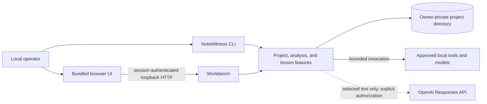
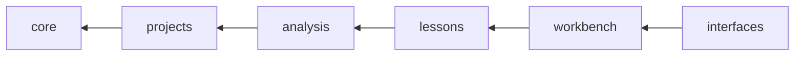
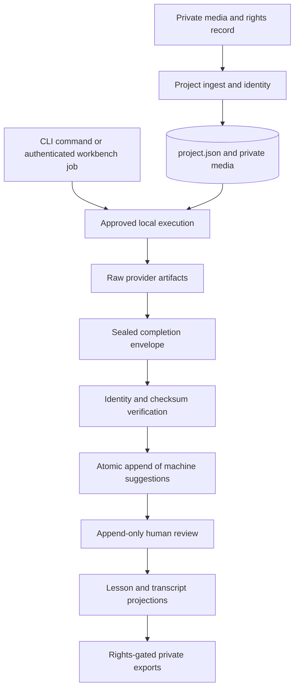

# Architecture

NoteWitness turns private music-lesson recordings into provenance-linked
evidence, review decisions, lesson projections, and exports. It ships as one
installable Python distribution that runs as one local process — not a set of
services. The only separately deployed piece is the browser-only mock-data demo
on GitHub Pages.

## System context

The CLI and the workbench compose the same project, analysis, and lesson
features. The browser holds no separate authority: it can call only the
operations the loopback server exposes, and it cannot supply executable, model,
score, or arbitrary filesystem paths.

## Packages and the authority gradient

The six packages follow the authority an operation needs, from pure values to
the delivery surfaces:

| Package | Responsibility | State and side effects |
|---|---|---|
| `core` | Evidence graph contract and validation; time, audio, transcription, analysis, lesson, and export value rules; strict JSON helpers | None; standard-library-only and side-effect free |
| `projects` | The owner-private storage boundary: private filesystem and SQLite primitives, project creation, `project.json` persistence and atomic mutation, media ingest, private artifacts | Sole mutator of `project.json`; owns `media/` |
| `analysis` | Machine hypotheses: bounded local execution, the transcription and analysis-suite pipelines, and the shared run workspace, publication, and integration | Owns `runs/` artifacts and `runs/analysis-jobs.sqlite` |
| `lessons` | Human decisions and their projections: append-only review rules, actors, capture records, lesson notes, transcript and music exports, opt-in remote text suggestions | Mutates evidence only through `projects`; writes guarded exports |
| `workbench` | Loopback HTTP, session and request security, browser assets, operator runtime configuration, and browser-requested processing jobs | Owns `runs/workbench-jobs.sqlite` and the processing lock |
| `interfaces` | CLI composition, the capability registry, and the installed provider-bridge executables | Outer composition boundary |

Security invariants are stated against this gradient: only `projects` writes the
canonical document, automatic output from `analysis` stays machine-suggested,
and only `lessons` turns it into human evidence or an export.

### Where each feature lives

| Feature | Modules |
|---|---|
| Evidence graph | `core/evidence/*` (contract, graph, validation); public API `notewitness.evidence`; loading in `projects/document.py`, persistence in `projects/store.py` |
| Private storage | `projects/private_fs.py` (pinned directories, no-follow walks, identities), `projects/private_sqlite.py` (hardened SQLite files), `projects/artifacts.py` (exclusive private writes) |
| Media ingest and capture | `projects/media.py`; browser capture records in `lessons/capture.py`; HTTP streaming in `workbench/media.py` |
| Bounded local execution | `analysis/local_tools/*`; `launcher.py` is executed by path and stays self-contained |
| Transcription | Values in `core/transcription/*`; Whisper adapter, runtime, and evidence in `analysis/transcription/*`; review in `lessons/transcript_review.py`; export in `lessons/transcript_export.py` |
| Analysis suite | Values in `core/analysis/*`; adapter, protocol, identity, evidence, one-shot runtime, resumable coordinator, checkpoints, job store, and job orchestration in `analysis/suite/*`; reference provider executables in `interfaces/bridges/*` |
| Run lifecycle | `analysis/runs/workspace.py` (run directories, media resolution, identities, status), `publication.py` (sealed envelope), `integration.py` (verification and atomic append) |
| Review and actors | `lessons/review_rules.py`, `lessons/evidence_review.py`, `lessons/actors.py` |
| Lesson projections | `core/lesson/model.py`, `lessons/lesson_notes.py`, `lessons/lesson_projection_*.py`, `lessons/pedagogical_digest.py`, `analysis/speaker_alignment.py`, `workbench/timeline.py`, `workbench/snapshot.py` |
| Exports | `core/exports.py` (loss gates), `lessons/music_export*.py`, `lessons/transcript_export.py` |
| Remote suggestions | `lessons/network.py` (bounded transport), `lessons/openai_responses.py` |
| Workbench processing | `workbench/runtime_config.py`, `workbench/jobs.py`, `workbench/processing.py`, `workbench/executor.py` |

`src/notewitness/evidence.py` is the one deliberately public Python module. The
supported external surface is otherwise what is documented and installed: the
commands and their JSON output, the file and schema formats, the provider
protocols, the runtime configuration, and the bundled workbench routes.
Internal Python module paths are alpha implementation details; the
`code_surface` field of `notewitness capabilities` names them for orientation
only.

## Dependency direction

Dependencies point from a later package to any earlier one:

`tests/contract/test_architecture.py` enforces, by reading the AST, that:

- imports follow this direction, including the root modules (`evidence.py` may
  use `core` and `projects`; `__main__.py` only `interfaces`);
- `core` imports no I/O module and never calls `open()`;
- every internal import resolves to an existing module and name;
- an underscore-prefixed module is imported only from its own package;
- `analysis/local_tools/launcher.py` imports nothing from NoteWitness and parses
  as Python 3.9.

`tests/contract/test_repository.py` additionally keeps package `__init__.py`
files free of re-exports, so every name has one import path.

A concept lives in the package that owns its behavior, inside the feature
subpackage when there is one. The architecture deliberately has no `utils`,
`helpers`, `common`, or service layer; a primitive shared across packages lives
at the lowest layer that owns its meaning (`core/strict_json.py`,
`projects/private_fs.py`).

## How evidence flows

Raw provider output, normalized machine hypotheses, human review, and derived
exports stay separate records. A model rerun cannot overwrite a human review
record.

There are two publication paths into `project.json`:

- One-shot transcription and analysis runs write a sealed
  `publication.completed.json` envelope; `analysis/runs/integration.py` verifies
  it and appends its records to the latest project transaction, so unrelated
  bookmarks, review decisions, and practice changes made during processing are
  preserved.
- Resumable analysis-suite jobs publish once, after all stages complete, through
  a compare-and-swap mutation against the snapshot they validated.

The workbench and the analysis suite keep separate durable schedulers:

- `runs/workbench-jobs.sqlite` records browser-requested passes, attempts,
  cancellation, recovery, and step checkpoints. One job runs at a time per
  project, guarded by `runs/workbench-processing.lock`, and it executes the
  one-shot runtimes.
- `runs/analysis-jobs.sqlite` records CLI analysis-suite leases, heartbeats,
  continuation checkpoints, cancellation, and raw replay.

The split is deliberate: the first is the user-facing workbench lifecycle; the
second is resumable execution of external analysis stages. Workbench resume can
reconcile an already integrated immutable run without invoking the provider
again. The workbench lock does not exclude a concurrent CLI run; both publish
through the project writer lock.

## Project state and the filesystem boundary

An initialized project contains the canonical `project.json` document plus
owner-private `media/`, `runs/`, and `exports/` directories. `projects` is the
only package allowed to mutate the canonical evidence document. Mutations use
validation, an advisory writer lock, optional content-hash compare-and-swap,
atomic replacement, and directory synchronization.

Project-scoped runtime writes use the pinned private-directory capability in
`projects/private_fs.py`. File creation, staging, sidecar handling, and
unlinking are directory-FD-relative and revalidate the original device and
inode. Python's `sqlite3` API cannot open relative to a directory FD, so
`projects/private_sqlite.py` pins and revalidates the parent directory around
the pathname-based SQLite lifecycle for both job stores. Replacement is
rejected, but this cannot eliminate every race with a malicious process running
as the same user.

Files are trusted under four distinct models, and each keeps its own checks:

| Model | Rule | Home |
|---|---|---|
| Owner-private project state | Owned by the user, no group or other access, no symlink in any path component | `projects/private_fs.py`, `projects/store.py`, `projects/private_sqlite.py` |
| Operator artifacts (executables, the runtime configuration's directory) | Owned by the user or root, not group- or world-writable | `analysis/local_tools/discovery.py` |
| Source media being ingested | Any mode, but a regular file reached without symlinks; identity rechecked while copying | `projects/media.py` |
| Portable documents (`validate`, `inspect`) | Ordinary bounded read | `projects/document.py` |

The portable graph-loading path deliberately does not assert the private
project-directory contract; all local project mutation still goes through
`ProjectStore`.

## External execution and configuration

External executables, model artifacts, settings, versions, and licenses are
operator-supplied and separately identified. The current macOS runner denies
network operations and bounds arguments, environment, time, output, resource
use, and process-group cleanup. It checks executable and input identities
around execution. It does not confine filesystem access beyond the invoking
user's permissions.

Workbench processing stays disabled unless `--runtime-config` names an absolute,
owner-private JSON file. Configuration version 2 assigns an executable, model,
version, license, timeout, and bounded parameter object per analysis stage;
version 1 files are still accepted. The server validates that configuration at
startup and exposes only approved capabilities to the browser.

External analysis engines extend the application through the strict
[analysis-suite JSON v1 protocol](analysis-suite-protocol.md). Maintained local
normalizers and their runtime boundaries are described in
[provider-bridges.md](provider-bridges.md). These are executable integration
contracts, not a general in-process plugin API.

The optional OpenAI path is outside local analysis. It reads configuration from
`OPENAI_API_KEY` and `NOTEWITNESS_OPENAI_MODEL` only after project policy,
rights, selected-event, and per-call consent checks. It sends selected text,
uses the fixed Responses endpoint with `store: false`, and returns only machine
suggestions. See [openai-endpoint.md](openai-endpoint.md) for the complete data
boundary.

## The workbench trust boundary

The server binds only to `127.0.0.1`. A single-use launch token establishes an
`HttpOnly`, host-only, `SameSite=Strict` session cookie. Private reads require
the session; mutations additionally validate Host, Origin, and CSRF data.
Malformed requests fail with the workbench's own request errors; review and
evidence rules fail with the `lessons` review errors. Project actor IDs provide
evidence attribution, not authentication or authorization. The process serves
one local user and must not be exposed through a proxy or tunnel.

This boundary limits unintended browser access. It does not defend against a
malicious process already running with the same user's filesystem authority.
The [security policy](../SECURITY.md) records the supported and residual
security boundary.

## Build and deployment boundaries

Hatchling builds one dependency-free `notewitness` wheel containing the Python
package and the workbench assets. It installs the `notewitness`,
`notewitness-provider-bridge`, and `notewitness-mt3-events-bridge` commands.
There is no container, hosted application service, database service, migration
system, or production deployment definition in this repository. The SQLite job
stores and `project.json` schema 0.1.0 have no migration mechanism.

The GitHub Pages workflow builds a browser-only, mock-data demo from the bundled
renderer and the synthetic example. It makes no server requests and cannot
access devices, run local processing, persist a project, or export. It
demonstrates the interface; it is not a deployment of the private workbench.

## Invariants and non-goals

- Source rights and provenance remain explicit at every evidence boundary.
- Automatic output remains machine-suggested until append-only human review.
- Project evidence mutations remain atomic, validated, and owner-private.
- External tools and models remain operator-managed and separately licensed.
- Local software execution is not evidence of model quality, fairness, corpus
  suitability, browser support, or pedagogical validity.
- NoteWitness does not provide multi-user hosting, remote project access,
  persistent person identification, learner grading, or automatic diagnosis.

The rationale for this shape is recorded in
[decisions/0001-feature-modular-monolith.md](decisions/0001-feature-modular-monolith.md)
and [decisions/0002-authority-layers-and-feature-subpackages.md](decisions/0002-authority-layers-and-feature-subpackages.md).
